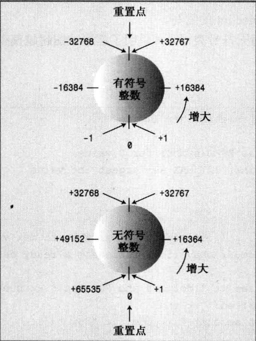

# C

## 预处理与编译

### 编译过程概述

程序生成的步骤为**预处理**、**编译**、**链接**，其详情信息如下

| 过程名                   | 负责的程序 | 工作                                                         | 输入文件                         | 输出文件                                     | 注释                                                        |
| ------------------------ | ---------- | ------------------------------------------------------------ | -------------------------------- | -------------------------------------------- | ----------------------------------------------------------- |
| 预处理、预编译Precompile | Compiler   | 主要做的是代码文本的替换工作，将头文件的内容插入到引用的源文件里、去除注释空行等 | 头文件(`*.h`)和源代码文件(`*.c`) | `*.i`文件                                    | 此时还是可读的                                              |
| 编译阶段                 | Complier   | 将预处理后的代码变成汇编代码。然后将生成的汇编文件转成二进制目标代码文件。 | `*.i`文件                        | 机器码文件`*.o`（不同的操作系统命名不同）    | 细化分的话可以分成编译(compilation)和汇编(assemble)两个阶段 |
| 链接                     | Linker     | 将目标文件和一些外来的附加的库进行链接                       | 机器码文件`*.o`和库文件`.a`      | 可执行文件`.out`(linux)或是`.exe`（windows） |                                                             |

更详细的内容请看笔记[静态库与动态库]()


### 常见预处理指令

| 预处理指令     | 意义                                                         |
| -------------- | ------------------------------------------------------------ |
| `#define`      | 宏定义，定义一些宏                                           |
| `#undef`       | 撤销已定义过的宏                                             |
| `#include`     | 将指定的源文件插入到这一行的位置                             |
| `#if` `#endif` | 两者连用，如果 `#if` 后的常量表达式为true，则编译两者之间的代码，否则跳过 |
| `#elif`        | 位于在`#if` 和 `#endif` 代码块之间，表示有条件分支，在 `#if` 不成立且自己成立时编译 |
| `#else`        | 位于在`#if` 和 `#endif` 代码块之间，表示无条件的分支，在 `#if` 和`elif`都不成立时编译 |
| `#ifdef`       | 如果有定义，则编译它与 `#endif` 之间的代码，这是条件编译的另一种方法 |
| `#ifndef`      | 与 `ifdef` 相反，表示如果没有定义过                          |
| `#line`        | 改变当前行数和文件名称，它们是在编译程序中预先定义的标识符。命令的格式为`#line number["filename"]` |
| `#error`       | 编译时，只要遇到该指令就会产生一个编译错误提示信息，并停止编译 |
| `#pragma`      | 为实现时定义的指令，它允许向编译程序传送各种指令如，编译程序可能有一种选择，它支持对程序执行的跟踪。可用其指定一个跟踪选择 |

### 预处理的骚操作


## 变量

使用`<type-name> <virable-name>`声明变量

```c
int ma;
```

这些语句告诉程序，它正在存储整数，并使用名称 braincount 来表示该整数的值（这里为 5) 。实际上 ，程序将找到一块能够存储整数的内存，将该内存单元标记为ma,然后，您可在程序中使用 ma 来访问该内存单元。这些语句没有告诉您，这个值将存储在 内存的什么
位置，但程序确实记录了这种信息。实际上，可以使用＆运算符来检索ma 的内存地址。

**对变量名的一些规定**

以两个下划线或下划线和大写字母打头的名称被保留给实现（编译器及其使用的资源）使用。以一个下划线开头的名称被保留给实现，用作全局标识符 。

C99 标准只保证名称中 的前 63 个字符有意义（在 ANSI C 中，前 63 个字符相同的名称被认为是相同的，即使第 64 个字符不同）。

**变量初始化**

如果不对函数内部定义的变量进行初始化，该变量的值将是不确定的 。 这意味着该变量的值将是它被创建之前，相应内存单元保存的值 。


## 数据类型

计算机内存由 一些叫做位(bit) 的单元组成。8 位可以设置出 256 种不同的组合，因为每一位都可以有两种设置。因此，8 位单元可以表示 0-255 或者 -128 到127 。 每增加一位，组合数便加倍。所以，可以把 16 位单元设置成 65536 个不同的值，把 32 位单元设置成 4294672296 个不同的值，把 64 位单元设置为18446744073709551616 个不同的值 。

宇节(byte ) 通常指的是 8 位的内存单元

### 基本类型


#### 整型

C的整形有 short 、int 、long 和 long long 类型，通过使用不同数目的位来存储值，最多能够表示 4 种不同的整数宽度 。short 是 short int 的简称，而 long 是 long int 的简称

C提供了 一种灵活的标准，它确保了最小长度

- short 至少 16 位；
- int 至少 与 short 一样长；
- long 至少 32 位 ，且至少与 int 一样长；
- long long 至少 64 位，且至少与 long 一样长 。
  
通常，int 被设置为对目标计算机而言最为“ 自然” 的长度。自然长度(natural size) 指的是计算机处理起来效率最高的长度。如果没有非常有说服力 的理由来选择其他类型，则应使用 int 。

当前很多系统都使用最小长度，即 short 为 16 位 ，long 为 32 位 。

16 位的 int 的取值范围为 -32768 到 +32767 。

一般来说，在32位机器和64机器中int类型都占用4个字节（32位），其中1位标识符号，31位标识大小。


**整型字面值/常量**

整型字面值（常量）是显式地书写的常量，如 212 或 1776 。能够以三种不同的计数方式来书写整数：基数为 10 、基数为 8( 老式 UNIX 版本 ） 和基数为 16( 硬件黑客的最爱 ）。

- 如果第一位为1~9, 则基数为10 (十进制）
- 如果第一位是 0,第二位为1~7,则基数为 8（八进制）；
- 如果前两位为 0x 或 OX, 则基数为16 (十六进制），对千十六进制数，字符 a~f 和 A~F 表示了十六进制位。

不管把值书写为10 、012 还是 0xA,都将以相同的方式存储在计算机中——被存储为二进制数（以 2 为基数）。

程序将 把1492 存储 为int 、long 还 是其他整型呢?答案是 ，除非有理由存储为其他类型（如使用了特殊的后缀来表示特定的类型，或者值太大，不能存储为int),否则 C++将整型常 量存储为int类型 。

- 后缀是放在数字常量后面的字母，用于表示类型。整数后面的l 或 L 后缀表示该整数为 long 常量， u 或 U 后缀表示 unsigned int 常量。ul ( 可以采用任何一种顺序，大写小写均可）表示 unsigned long 常量。同样提供了用于表示类型 long long 的后缀 11 和 LL, 还提供了用于表示类型 unsigned long long 的 后缀 ull 、Ull 、uLL 和 ULL。 

  ```c
  12l;
  12u;
  123ul;
  ```

- 对于不带后缀的十进制整数，将使用下面几种类型中能够存储该数的最小类型来表示：int 、 long 或 long long 。在int 为16 位、long 为32 位的计算机系统上，20000 被表示为int 类型，40000 被表示为long 类型，3000000000 被表示为 long long 类型 。对于不带后缀的十六进制或八进制整数，将使用下面几种类型中能够存储该数的最小类型来表示：int 、unsigned int long 、unsigned long 、long long 或 unsigned long long 。在将 40000 表示为 long 的计算机系统中， 十六进制数 0x9C40（40000) 将被表示为 unsigned int 。 这是因为十六进制常用来表示内存地址，而内存地址是没有符号的，因此，usigned int 比 long 更适合用来表示16 位的 地址 。


**字符型**

char 类型是专为存储字符（如字母和数字）而设计的。它足够长，能够表示目标计算机系统中的所有基本符号所有的字母、数字、标点符号等。例如，很多系统支持的字符都不超过 128 个，因此用一个字节就可以表示所有的符号 。

C的基础类型中没有宽字符类型（但可以通过头文件扩展），而C++有。

与int 不同的是，char 在默认情况下既不是没有符号，也不是有符号。 是否有符号由实现决定 ，这样编译器开发人员可以最大限度地将这种类型与硬件属性匹配起来 。如果 char 有某种特定的行为非常重要，则可以显式地将类型设置为 signed char 或 unsigned char

**溢出问题**

整型变量的行为就像里程表 。 如果超越了限制，其值将为范围另一端的取值。



**无符号类型**

使用关键字unsigned 来修改声明即可创建无符号版本的基本整型，其表示的范围全部为非负整数

```c
unsigned short change;
unsigned int rovert;
unsigned quarterback;
unsigned long gone;
unsigned long long lang_lang;
```

unsigned 本身是 unsigned int 的缩写。


要知道系统中整数的最大长度，可以使用`sizeof`运算符，其返回类型或变量的长度，单位为字节。对类型名（如 int) 使用 sizeof 运算符时，应将名称放在括号中；但对变量名（如 a) 使用该运算符，括号是可选的：

```c
sizeof(double);
int a = 10;
sizeof(a);
sizeof a;
```

在头文件`limits.h` 包含了关于整型限制的信息。具体地说，它定义了表示各种限制的符号名称。

```c
INT_MAX;	// int的最大取值，在32位表示int的机子上其为 0x7fffffff

CHAR_BIT;	// 为字节的位数
```

文件中是通过`#define INT_MAX 32767`这样的语句来定义的，以下表格列出了所有定义

| 符号常量     | 表示                        |
| ------------ | --------------------------- |
| `CHAR_BIT`   | char 的位数                 |
| `CHAR_MAX`   | char 的最大值               |
| `CHAR_MIN`   | char 的最小值               |
| `SCHAR_MAX`  | signed char 的最大值        |
| `SCHAR_MIN`  | signed char 的最小值        |
| `UCHAR_MAX`  | unsigned char 的最大值      |
| `SHRT_MAX`   | short 的最大值              |
| `SHRT_MIN`   | short 的最小值              |
| `USHRT_MAX`  | unsigned short 的最大值     |
| `INT_MAX`    | int 的最大值                |
| `INT_MIN`    | int 的最小值                |
| `UINT_MAX`   | unsigned int 的最大值       |
| `LONG_MAX`   | long 的最大值               |
| `LONG_MIN`   | long 的最小值               |
| `ULONG_MAX`  | unsigned long 的最大值      |
| `LLONG_MAX`  | long long 的最大值          |
| `LLONG_MIN`  | long long 的最小值          |
| `ULLONG_MAX` | unsigned long long 的最大值 |


#### 浮点型

使用浮点类型可以表示带小数部分的数字。计算机将这样的值分成两部分存储。一部分表示值，另 一部分用千对值进行放大或缩小 。浮点数能够表示小数值、非常大和非常小的值，它们的内部表示方法与整数有天壤之别。


C有 3 种浮点类型：float 、double 和 long double 。这些类型是按它们可以表示的有效数位和允许的指数最小范围来描述的 。有效位
( significant figure ) 是数字中有意义的位。有效位数不依赖千小数点的位置。 C 和 C++对于有效位数的要求是：float 至少 32 位； double 至少 48 位，且不少于 floa；long double至少和 double 一样多。这三种类型的有效位数可以 一样多。然而 ，通常，
float 为 32 位，double 为 64 位，long double 为 80 、 96 或 128 位 。另外 ，这 3 种类型的指数范围至少是-37 到 37 。 

可以从头文件 float.h中找到系统的限制 。


有两种书写浮点数 的方式 。第一种是使用常用的标准小数点表示法 ：

```c
1.231;
8.0;	// 即使小数部分为 0 (如 8.0 ) ,小数点也将确保该数字以浮点格式（而不是整数格式）表示。
```

第 二种表示浮点值的方法叫做 E 表示法

```c
2.52e+8;
8.33E-4;
```

E 表示法最适合千非常大和非常小的数 。E 表示法确保数字以浮点格式存储，即使没有小数点。注意，既可以使用 E 也可以使用
e, 指数可以是正数也可以是负数 。然而，数字中不能有空格。

**浮点型字面量/常量**

在程序中书写浮点常量的时候，在默认情况下，像 8.24 和 2.4E8 这样的浮点常量都属于 double 类型。如果希望常量为 float 类型 ，使用 f 或 F后 缀 。 对于 long double 类型 ，可使用 l 或 L 后缀


### 空类型

### 枚举类型

### 派生类型


#### 数组

数组 (array) 是一种数据格式，能够存储多个同类型的值 。 每个值都存储在一个独立的数组元素中，计算机在内存中依次存储数组
的各个元素。声明格式如下：

```C
// 数据类型 变量名[元素数量];
int a[10];
```

C99标准之前，声明数组时指定的元素数量必须是整形常数，也可以是常量表达式（但不能是const值，而C++可以）即要求其所有值在编译时必须已知（不能是运行时设置的变量）。C99标准允许这样声明，这创建了一种新型数组，称为变长数组（variable-length array）或简称 VLA（C11 放弃了这一创新的举措，把VLA设定为可选，而不是语言必备的特性）。

也可以不显示指定元素数量，而通过初始化的方式让编译器自动推断

```C
int a[] = {1,2,3,4,5,6};		// 编译器会自动推断，建立长度为6的整型数组
```

**初始化**

只有在定义数组时才能使用初始化，此后就不能使用了，也不能将一个数组赋给另一个数组。

C语言使用一个用逗号分隔的值列表（初始化列表）来进行初始化，用花括号括起。初始化数组时，提供的值可以少于数组的元素数目，这种情况只会初始化前几个元素而把把其他元素设置为0 

```C
int a[2] = {1,2};
```

如果没有初始化函数中定义的数组，则其元素值将是不确定的，这意味着元素的值为以前驻留在该内存单元中的值。

编译器不会检查使用的下标是否有效，但成勋运行后会引发问题，严重地会使程序崩溃和异常终止。所以需要程序员自行确定使用地下标有效。

C 不允许把数组作为一个单元赋给另一个数组，除初始化以外也不允许使用花括号
列表的形式赋值。

**指定初始化器**

C99增加了一个新特性：指定初始化器（designated initializer）。利用该特性可以初始化指定的数组元素，在初始化列表中使用带方括号的下标指明待初始化的元素，未初始化的元素都会被设置为0。

```c
int a[10]={[5]=21};
```

如果指定初始化器后面有更多的值，那么后面这些值将被用于初始化指定元素后面的元素。

```c
int a[5]={[2]=10,2,3};
// 上述a的数值为 0，0，10，2，3
```

对于未指定数组元素多少，编译器也会自动计算

```c
int a[] ={1,[3]=1,3,4};
// 上述 a 的长度为6， 其数值分布为，1，0，0，1，3，4
```


变长数组


**字符串**

C语言使用`char*`或是`char[]`来存储字符串，被称为 C-风格字符串(C-style string)。

它以空字符(null character) 结尾，空字符被写作 `\0`, 其 ASCII 码为 `0`,用来标记字符串的结尾 。  

对于使用数组存储字符串，数组的长度必须是字符串字符个数加一，因为最后要存储空字符。

```c
char str[12]={'h','e','l','l','o',' ','w','o','r','l','d'};
```

同时还可以直接使用字符串常量进行初始化。用引号括起的字符串隐式地包括结尾的空字符，可以让编译器自动推断也可以手动指定字符的长度（刚好得到的数组的长度都是字符串字符个数加一）。如初始化时指定的数组长度比字符串更长，则其余的元素位置都默认填充`\0`，如比字符串短，是不被编译器允许的。如果是使用的各种输入函数读入字符串，也会自动加上结尾的空字符。

```c
char str[5]='234';			//
char str[]='123';		// 
```


在头文件string.h中定义了很多操作C-风格字符串的函数，如可以使用函数 strcpy()将字符串复制到字符数组中，使用函数 strcat()将字符串附加到字符数组末尾：

```C
strcpy(charrl, charr2); // copy charr2 to charrl
strcat(charrl, charr2);// append conten七 s of charr2 to charl
```

使用上述两个函数总是存在目标数组过小，无法存储指定信息的危险。C 函数库确实提供了与 strcat()和 strcpy()类似的函数—-strncat()，strncpy()。它们接受指出目标数组最大允
许长度的第三个参数，因此更为安全。

**sizeof运算符**

sizeof运算符返回类型或数据对象地长度（单位为字节）。对数组名使用则得到的是整个数组的字节数。将 sizeof 用千数组元素，则得到的将是元素的长度（单位 为字节）

**strlen()函数** 

strlen()函数返回的是存储在数组中的字符串的长度，而不是数组本身的长度。另外，
strlen()只计算可见的字符，而不把空字符计算在内。


**复合字面量**

C99新增了复合字面量（compound literal）

```c
(int [2]){10, 20} // 复合字面量
```

可以省略数组大小，编译器会自动计算

```c
(int []){50, 20, 90} // 内含3个元素的复合字面量
```

复合字面量是匿名的，所以不能先创建然后再使用它，必须在创建的同时使用它。

可以初始化指针，

```c
int *pt1;
pt1 = (int [2]) {10, 20};
```

还可以给函数传参

```c
int sum(const int ar[], int n);
int total = sum( (int []){4,4,4,5,5,5}, 6);
```


#### 结构体类型

结构是一种比数组更灵活的数据格式，因为同一个结构可以存储多种类型的数据。

结构属于用户定义的类型，需要先声明定义。使用关键`struct`来定义结构体，在大括号里定义各个成员变量。

```c
struct stct1{
	int num;
    char name[20];
    double price;
};
```

关键字 struct 表明 ，这些代码定义的是一个结构的布局。 struct关键字后跟的是标识符，是这种数据格式的名称，这样，便可以像新建 char 或 int 类型的变量那样使用标识符创建对应struct类型的变量了。

定义结构体后，便可以使用`struct 结构体类名 变量名`创建这种类型的变量了

```C
struct stct1 xiaoming;	// xiaoming 为新建变量
```

和数组一样，结构体变量使用列表按照成员变量定义的顺序进行初始化，且只能在定义时对全部成员变啊零进行初始化。之后结构体变量不能在使用列表进行整体赋值，只能针对单个成员变量进行修改。

```c
struct stxt1 wang = {
    1,
    "wanglaoshi",
    12.1;
}
```

C语言的结构中不能定义函数，但可以声明指向函数的指针，在结构体变量初始化时可以为其指定一个已有函数的地址。

```c
struct vnode{
	char *s;
	void (*print_s) (struct vnode *vnd);
};

void vnode_print_s(struct vnode *vnd){
	printf("%s", vnd->s);
} 
void vnd_init(struct vnode *node, const char *s) {
    node->s = (char*)malloc(strlen(s)+1); 
    strcpy(node->s, s); 
    node->print_s = vnode_print_s; 
} 
void vnd_destroy(struct vnode *node){ 
    if(node->s){ 
        free(node->s); 
    } 
} 
int main() { 
    struct vnode vnd; 
    char s[] = "Hello\n"; 
    vnd_init(&vnd,s); 
    vnd.print_s(&vnd); 
    vnd_destroy(&vnd); 
    return 0; 
}
```


结构体可以在所有函数外面进行声明，称为外部声明。也可以在在函数内部声明，称为内部声明。

外部声明可以被其后面的任何函数使用，而内部声明只能被该声明所属的函数使用，且只能被声明后边的语句使用。


使用成员运算符`.`来访问各个成员

```c
stct1.name;
```


#### 位域

#### 共用体类型

共用体有时也被称为联合或者联合体，是 Union 这个单词的本意。

C语言的共用体类型使用 `union` 声明，可用来声明变体类型（variant type）。

结构体的各个成员会占用不同的内存，互相之间没有影响；而共用体的所有成员占用同一段内存，修改一个成员会影响其余所有成员。

结构体占用的内存大于等于所有成员占用的内存的总和（成员之间可能会存在缝隙），共用体占用的内存等于最长的成员占用的内存。共用体使用了内存覆盖技术，同一时刻只能保存一个成员的值，如果对新的成员赋值，就会把原来成员的值覆盖掉。


新类型定义如下

```C
union 共用体名{
	成员列表
};
```

使用时

```c
union 共用体名 varName;
varName.成员;
```


如果定义的共用体类型只使用一次，那么也可以匿名同时进行变量定义，如下

```c
union{
    成员列表
} var1, var2, var3;
var1.成员;
```


当结构体中使用共用体类型的变量时，需要使用诸如`v->u.n`的形式去访问共用体的成员，较为繁琐。 C11 标准新增了匿名 struct/union 语法，就可以采用 `v->n`、`v->s`、`v->len` d来作访问。


#### 指针


**数组与指针的区别**


**函数指针**


#### 函数类型


### 数据类型转换

**自动执行的类型转换**

将一种算术类型的值赋给另一种算术类型的变量时

- 将一个值赋给值取值范围更大的类型通常不会导致什么问题。
- 将较大的浮点类型转换为较小的浮点类型，精度（有效数位）降低，值可能超出目标类型的取值范围，结果将是不确定的
- 将浮点类型转换为整型，小数部分丢失，原来的值可能超出目标类型的取值范围，结果将是不确定的。将浮点型转换为整型时，采取截取（丢弃小数部分）而不是四舍五入（查找最接近的整数）。
- 将较大的整型转换为较小的整型，原来的值可能超出目标类型的取值范围，通常只复制右边的字节
- 将 0 赋给 bool 变量时，将被转换为 false;而非零值将被转换为 true 。


**强制类型转化**

C语言中使用`(<typename>)<virable>`进行强制类型，强制类型转换不会修改变量(或是常量)本身，而是创建一个新的、指定类型的值。

```C
short a =10;
(int)a;			// 返回int类型的值 10
(int)'a';		// 返回int类型的字母a对应的ascii码值
```


## 操作符

### 运算符优先级和结合性

算术运算符遵循通常的代数优先级，先乘除，后加减 ，其中，＊、/和％的优先级相同。 可以使用括号来执行自己定义的优先级。

当 两个运算符的优先级相同时，将看操作数的结合性( associativity) 是从左到右，还是从右到左。从左到右的结合性意味着如果两个优先级相同的运算符被同时用于同一个操作数，则首先应用左侧的运算符。从右到左的结合性则首先应用右侧的运算符 。乘除都是从左到右结合的。

## 基本语法

### 循环


### 判断


## 作用域


## 函数


### main()函数

main() 被启动代码调用，而启动代码是由编译器添加到程序中的，是程序和操作系统( UNIX 、Windows或其他操作系统）之间的桥梁。

省略返回类型相当于说函数的类型为int 。

```c
main();			// 这样写缺省返回值是int
```

在C 中，让括号空着意味着对是否接受参数保持沉默，可以在括号中使用关键字void 明确地指出，函数不接受任何参数。

```c
int main(void);
```

main() 的返回值并不是返回给程序的其他部分，而是返回给操作系统。很多操作系统都可以使用程序的返回值。通常的约定是，退出值为 0 则意味着程序运行成功，为非零则意味着存在问题。


### 声明与定义


如果明确知道传入的指针类型的参数一定是不会指向同一片内存的可以加上`restrict`关键字，这样编译器将在优化时不再考虑指向同一片内存的可能。

考虑如下代码

```c++
int add(int*a, int * b){
    *a = 1;
    *b = 2;
    return *a + *b;
}
```

编译器会保留`a` 和 `b` 指向同一内存的可能，生成老老实实地一步一赋值然后读取相加地操作。但如果函数的定义如下

```C++
int add(int* restrict a, int* restrict b){
    *a = 1;
    *b = 2;
    return *a + *b; 
}
```

那么编译器会将代码优化为

```c++
int add(int* restrict a, int* restrict b){
    return 3; 
}
```


### 可变参数

### 函数指针

### 回调函数


## 输入输出与文件操作

### 标准化输出

#### 各式输出参数

```c
int printf(const char*restrict format, ...);
```

使用标准输出流stdout（终端），以格式化字符串（format string）作为函数参数来指定具体格式。


```c
int fprintf(FILE* restrict fp, const char*restrict format, ...);
```

写入 fp 指定的输出流。printf（）函数可以视为 fprintf（）的特殊版本。


```c
int sprintf(char* restrict buf, const char*restrict format，...);
```

将格式化数据写入 buf 指向的 char 数组，并在后面加上一个标志结尾的空字符。


在上述函数原型中出现的省略号（`...`），表示可选的可变参数。


一些  `printf()`函数系列需要一个指针参数，以指向一个参数列表，而不是在函数调用时直接接收数量可变的参数。这些函数的名称都以一个 v  开始，表示“variable argument list”（可变参数列表）的意思：

```c
int vprintf(const char * restrictformat, va_list argptr );
int vfprintf(FILE * restrict fp, const char * restrict format, va_list argptr );
int vsprintf(char * restrict buf, const char * restrict format, va_list argptr );
int vsnprintf(char * restrict buffer, size_t n, const char * restrict format, va_list argptr );
```

如果想使用支持可变参数列表的函数，除了头文件 stdio.h 以外，还必须包含头文件 stdarg.h。


上述函数都有相应的宽字符导向流版本。针对宽字符的 `printf()`函数名称中包括字符串 `wprintf `而不是 `pintf`，例如，`vfwprintf()`和 `swprintf()`等。但有一个例外：没有 `snwprintf()`函数。而是采用 `snprintf()`对应到 `swprintf()`，该函数采用一个参数来指定最大输出长度。


> C11 标准为这些函数都提供了一个新的“安全”的版本。这些对应的新函数均以后缀 _s（例如，`fprintf_s()`）。


#### 格式化字符串

格式化字符串定义了数据的输出格式，并包含了一些普通字符和转换说明（conversion  specification）。

每个转换说明都定义了函数该如何将可选参数转换并格式化，以供输出。`printf()`函数将格式化字符串写入到输出，使用对应可选参数的格式化值来替代转换说明。

所有的转换说明（但 `%%` 是例外）都具有下面的通用格式：

```shell
%[标记][字段宽度][.精度][长度修饰符]修饰符
```

转换说明以百分号 `%` 开始，并以一个字母结尾，这称为转换修饰符（conversion specifier）。为了在输出中表示 `%`，需要一个特殊的转换修饰符：`%%`。`printf()`将该符号转换成一个单独的百分号。）

方括号内的这部分语法都是可选的。需要注意的是所有转换说明都可包含“字段宽度”（field width）。然而，并非所有的转换类型都有“精度”（precision）这个选项，对不同的修饰符来说，精度意义是不一样的。

##### 字段宽度

字段宽度必须是正的十进制整数（或者是一个星号），指定了对应的数据项所输出的最少字符数量。

```c
printf("%8s",str);
```

当指定的字段宽度小于实际字符串宽度时，按照实际宽度输出。大于实际宽度时使用指定的字符进行补齐，默认是空格。


可以使用一个变量来指定字段宽度。要实现这样的效果，采用一个星号（`*`）作为转换说明中的字段宽度，并在 `printf()`调用时包括一个额外的函数参数。该参数必须具有 int 类型，并且出现在需输出的参数之前。

```c
printf( "%-*s!\n", width, str );
```


##### 标记

默认情况下，字段中的被转换数据为右对齐（right-justified），左边多的位置用空格填补。如果标记包含减号（`－`），则为左对齐（left-justified），超出的字段宽度采用空格向右填补。

如果字段是右对齐的，可以采用 0 而非空格填充，其需要在转换说明的字段宽度前添加一个`0`。

```c
printf("%012s",str);
```


`%s` string, 一个字符串。

`%d` decimal, 一个 int 数值。

`%g` 根据数值的大小，自动选f格式或e格式（选择输出时占宽度较小的一种），且不输出无意义的0。即%g是根据结果自动选择科学记数法还是一般的小数记数法 。

`%e` 使用科学计数法。

`%n`

`%d`


## 错误处理


## 内存管理

使用`malloc()`来申请空间。需要手动指定申请空间的大小，还需要将申请的空间做显示类型转化以赋给类型符合的指针变量。

```c
char* s = (char*)malloc(1);
int* p = (int*)malloc(4*);
```


free 归还内存

```c
free(s);
free(p);
```


## 标准库


#### `strtod()`

将字符串转换成浮点数，是C语言及C++中的重要函数。

函数原型：

```c++
#include <stdlib.h>
double strtod(const char *nptr, char **endptr);
```

其会扫描参数`nptr`字符串，跳过前面的空格字符，直到遇上数字或正负符号才开始做转换，到出现非数字或字符串结束时(`'\0'`)才结束转换，并将结果返回。

若`endptr`不为`NULL`，则会将遇到不合条件而终止的`nptr`中的字符指针由`endptr`传回。其值由函数设置为 `nptr` 中数值后的下一个字符。

参数`nptr`字符串可包含正负号、小数点或`E(e)`来表示指数部分。如`123.456`或`123e-2`。


该函数返回转换后的双精度浮点数，如果没有执行有效的转换，则返回零（`0.0`）。如果前面是有效的转换，而之后无效则返回值是有效的部分，`endptr`则是无效位置。	


## 常见错误

# C++

## 前言

### 1. 关于C++

C++编程语言是一门古老的语言。它在演进中，背负了兼容C语言的重任。这也导致C++看起来什么都能干，像是一个大杂烩。

**名称**

 `C++` == `C Plus Plus` == `CPP`

**C++之父**

Bjarne Stroustrup 中译：本贾尼·斯特劳斯特鲁普


### 2. 经典C++和现代C++

C++11标准之前的C++被称为“Classic C++”，即经典C++。自C++11标准之后的C++被称为“Modern C++”即现代C++。

这个称呼的改变意味着C++从内到外有一个非常大的变化。

 


### 3. C++的编程范式

**编程范式**

所谓编程范式，通俗来讲，就是规范编程的一系列思想、方法以及程序设计语言构造块所构成的一种模式。

来自维基百科的定义如下：

>  **编程范型**、**编程范式**或**程序设计法**（英语：Programming paradigm），（**范**即模范、典范之意，范式即模式、方法），是一类典型的编程风格，是指从事[软件工程](https://zh.wikipedia.org/wiki/软件工程)的一类典型的风格（可以对照[方法学](https://zh.wikipedia.org/wiki/方法学)）。如：[函数式编程](https://zh.wikipedia.org/wiki/函數式編程)、[程序编程](https://zh.wikipedia.org/wiki/程序編程)、[面向对象编程](https://zh.wikipedia.org/wiki/面向对象编程)、[指令式编程](https://zh.wikipedia.org/wiki/指令式编程)等等为不同的编程范型。

编程范型提供了（同时决定了）[程序员](https://zh.wikipedia.org/wiki/程序员)对[程序](https://zh.wikipedia.org/wiki/程序)执行的看法。例如，在[面向对象编程](https://zh.wikipedia.org/wiki/面向对象编程)中，程序员认为程序是一系列相互作用的对象，而在[函数式编程](https://zh.wikipedia.org/wiki/函数式编程)中一个程序会被看作是一个无状态的函数计算的序列。

正如[软件工程](https://zh.wikipedia.org/wiki/软件工程)中不同的群体会提倡不同的“方法学”一样，不同的[编程语言](https://zh.wikipedia.org/wiki/编程语言)也会提倡不同的“编程范型”。一些语言是专门为某个特定的范型设计的（如[Smalltalk](https://zh.wikipedia.org/wiki/Smalltalk)和[Java](https://zh.wikipedia.org/wiki/Java)支持面向对象编程，而[Haskell](https://zh.wikipedia.org/wiki/Haskell)和[Scheme](https://zh.wikipedia.org/wiki/Scheme)则支持函数式编程），同时还有另一些语言支持多种范型（如[Ruby](https://zh.wikipedia.org/wiki/Ruby)、[Common Lisp](https://zh.wikipedia.org/wiki/Common_Lisp)、[Python](https://zh.wikipedia.org/wiki/Python)和[Oz](https://zh.wikipedia.org/wiki/Oz)）。

**不同的编程范式**

Structural Programming / Structured Programming（结构化编程）

- 又叫结构化程序设计。相对于可以使用goto那样可以任意跳转的程序设计，它是一种层次化的、规范化的有一定结构规定的设计，由约定好的基本结构组合而成。

- 它的原则思想可以归结为

  - 自顶向下，逐步细化;

    清晰第一，效率第二;

    书写规范，缩进格式;

    基本结构，组合而成。

- 自顶向下是指将一个任务分割按功能分割，逐层细化到能使用语句分别完成目标。

- 它规定程序包含三种结构

  - sequence 顺序结构
    执行完一个指令，再执行下一条指令
  - selection 选择结构
    程序进行条件判断，执行满足条件的程序块。
  - repetition 循环结构
    程序在满足条件时循环执行某个语句块

- 结构化编程是更基础的思想方法，它可以为面向过程编程所用，也可以在面向对象编程中体现所用。


Procedure-Oriented Programming（POP，面向过程编程）

- 其思想是分析问题，找出解决问题的步骤，然后使用编程语句一步一步实现。


Object-Oriented Programming (OOP, 面向对象编程)

- 将参与问题的因素归结为一个一个的对象，通过对对象属性的一些操作来达到解决问题的目的


Functional Programming（FP，函数式编程）

- 函数式编程是一种抽象程度很高的编程范式，其思想更接近数学计算


**C++的编程范式**

C++支持多种编程范式：过程性、面向对象、泛型、函数式等

在C++11之后才开始支持程序式编程


### 4. 编程工具的选择

 

简而言之，对于学习本课程的同学来说，大部分是处于编程的初学阶段。选择编程工具，第一个因素是工具是否是最新的。

 

因为随着编程语言的发展，编程工具，尤其是集成开发环境也在不断进步。新的工具会提供更加友好的界面，更加易读的提示信息、编译信息。

 

 

### 5. 学会安装配置一种集成开发环境

 

本课程中，主要介绍了两种集成开发环境：

1）微软的 Visual Studio

2）开源的 Eclipse CDT + GCC


## 相较于C的不同

### 文件形式

C的头文件为`*.h`，源文件为`*.c`。而C++的头文件为`*.h`，源文件为`*.cpp`，有的时候（例如Linux环境下）会发现，头文件也有`*.hpp`、`*.hxx`，源文件为`*.cxx`、`*.cc`。

C++的头文件对于C来说是有继承性的。一些老的C语言的头文件被移植到了C++风格的头文件，一般将`.h`去掉再在开头加上c以表示头文件来自于C。如C中的`math.h`到C++就变成了`cmath`


### 数据与数据类型

C++实现使用的是其主机系统的编码，例如，IBM 大型机使用 EBCDIC 编码。ASCII 和 EBCDIC 都不能很好地满足国际需要，C++支持的宽字符类型可以存储更多的值，如国际 Unicode 字符集使用的值 。

**wcha_t**

类型 wchar_t (宽字符类型）可以表示扩展字符集 。wchar_t 类型是一种整数类型，它有足够的空间，可以表示系统使用的最大扩展字符集。这种类型与另一种整型（底层(underlying ) 类型）的长度和符号属性相同。对底层类型的选择取决千实现，因此在一个系统中，它可能是 unsigned short, 而在另一个系统中，则可能是 int 。

cin 和 cout 将输入和输出看作是 char 流，因此不适千用来处理 wchar_t 类型 。iostream 头文件的最新版本提供了作用相似的工具wcin 和 wcout,可用千处理 wchar_t 流。可以通过加上前缀 L 来指示宽字符常量和宽字符串。另外，可以通过加上前缀 L 来指示
宽字符常量和宽字符串。

```c++
wchar_t bob= L'P';
wcout << L"tall"<< endl;
```

**C++11 新增的类型：charl6_t 和 char32_t**

C++11 新增了类型 char16_t 和 char32_t，其中前者是无符号的，长 16 位，而后者也是无符号的，但长 32 位 。C++ 11使用前缀 u 表示
char16_t 字符常量和字符串常量，如 u'C'和 u"be good"·; 并使用前缀 U 表示 char32_t 常量，如 U'R'和 U"dirtyrat"。

```c++
charl6_t chl = u'q ';
char32_t ch2 = U'\U0000222B';
```

与 wchar_t 一样，charl6_t 和 char32_t 也都有底层类型一种内置的整型，但底层类型可能随系统而已。

**bool类型**

C++标准添加了一种名叫 bool 的新类型。在计算中，布尔变量的值可以是 true 或 false 。它们分别用预定义的字面值 true 和 false 表示。

```c++
bool isReal = true;
```


**浮点型**

ostrearn 方法 setf() 。这种调用迫使输出使用定 点表示法 ，以便更好地了解精度 ，它防止程序 把 较大 的 值切 换为
E 表示法 ，使程序显示到小数点后6 位 。通常 cout 会删除结尾的零 。例如，将 3333333.250000 显示为 3333333.25 。调用 cout.setf()将覆盖这种行为 


**字符串**

C语言没有专门的类型表示字符串，只是使用`char*`或是`char[]`来表示。C++兼容这种表述形式，同时又有些不同。在将字符串常量赋给`char*`时，编译器会发出警告，因为通过指针可以修改字符串的值，但其实际上指向的是常量。所以在C++中最好使用`const`修饰符修饰。

另外C++98 标准通过添加 string 类扩展了 C廿库，因此现在可以 string 类型的变量（ C++中的对象）而不是字符数组来存储字符串。要使用 string 类，必须在程序中包含头文件 string ，同时string 类位千名称空间 std 中，使用之前必须声明

```c++
using std::string;
```

在很多方面，使用 string 对象的方式与使用字符数组相同 。

- 可以使用 C-风格字符串来初始化 string 对象。

  ```c++
  String third_date = {"The Bread Bowl"};
  String fourth_date {"Hank's Fine Eats} ;
  ```

  

- 可以使用 cin 来将键盘输入存储到 string 对象中.

- 可以使用 cout 来显示 string 对象。

- 可以使用数组表示法来访问存储在 string 对象中的字符。

类设计让程序能够自动处理 string 的大小。例如，strl 的声明创建一个长度为 0 的 string 对象，但程序将输入读取到 strl 中时，将自动调整 strl 的长度。未被初始化的 string 对象的长度被自动设置为 0

不能将一个数组赋给另一个数组，但可以将一个 string 对象赋给另一个 string 对象,

string类简化了字符串合并操作。可以使用运算符＋将两个 string 对象合并起来，还可以使用运算符＋＝将字符串附加到 string 对象的末尾。可以将 C-风格字符串或 string 对象与 string 对象相加，或将它们附加到 string 对象的末尾

另外可以使用`strl.size () `来获得字符串的长度(有几个字符)


**字符串常量拼接**

C++允许拼接字符串字面值，即将两个用引号括起的字符串合并为一个。任何两个由空白（空格、制表符和换行符）分隔的字符串常量都将自动拼接成一个。拼接时不会在被连接的字符串之间添加空格，第二个字符串的第一个字符将紧跟在第一个字符串的最后一个字符（第一个字符串中的 \0 字符将被第二个字符串的第一个字符取代。）


**原始字符串**

C++11 新增的另 一种类型是原始（raw) 字符串 。 在原始字符串中， 字符表示的就是自己，意思是转义字符将不再起作用，任何字符都表示它原来的意思。

原始字符串将`"(`和`)"`用作定界符，并使用前缀`R`来标识：

```c++
R"(Jim "King" Tutt uses 11 \ n" instead of endl.)"
```

输入原始字符串时，按回车键不仅会移到下一行，还将在原始字符串中添加回车字符。

如果要在原始字符串中包含`)"`，怎么办？原始字符串语法允许自定义界定符，即在表示字符串开头的`"`和`(`之间添加其他字符，同时字符串结尾的`"`和`)`之间也必须包含这些字符。

```c++
cout << R"+*(" (Who wouldn't? )", she whispered.)+*";
// 将显示 " (Who wouldn't?)", she whispered.
```

可将前缀 R 与其他字符串前缀结合使用，以标识 wchar_t 等类型的原始字符串 。可将 R 放在前面，也可将其放在后面，如 Ru 、UR 等 。


**结构体**

结构是 C++OOP 堡垒（类）的基石。

C++中的结构体允许在声明结构变量时省略关键字 struct。这种变化强调的是，结构声明定义了 一种新类型。在C++中，省略 struct 不会出错。

与数组一样，C++l11也支待将列表初始化用于结构，且等号（＝）是可选的，如果大括号内未包含任何东西，各个成员都将被设置为零。


**复合字面量**

C中的复合字面量在C++中是没有的。


#### 数据类型转化

除了兼容C的数据类型转换，C++11还提供以｛｝方式初始化时进行的转换。


**列表初始化**

C++11 将使用大括号的初始化称为**列表初始化(list-initialization)**，因为这种初始化常用于给复杂的数据类型提供值列表。它对类型转换的要求更严格。

- 列表初始化不允许缩窄(narrowing)，即变量的类型可能无法表示赋给它的值的情况 。例如，不允许将浮点型转换为整型 。
- 在不同的整型之间转换或将整型转换为浮点 型可能被允许，条件是编译器知道目标变量能够正确地存储赋给它的值 。例如，可将 long 变量初始化为int 值，因为 long 总是至少与 int 一样长；相反方向的转换也可能被允许，只要 int 变量能够存储赋给它的 long 常量

**表达式中的数据转换**

C++将执行两种自动转换：

- 一些类型在出现时便会自动转换；在计算表达式时，C++将 bool 、char 、unsigned char 、signed char 和 short 值转换为int。

- 有些类型在与其他类型同时出现在表达式中时将被转换 。

  ```c++
  short chickens= 20;
  short ducks = 35;
  short fowl= chickens + ducks;// 这里等式右边的两个变量，编译器会先将他们转化为int，计算完后再将结果转化为short赋给左边
  ```

还有其他一些整型提升：如果 short 比 int 短，则 unsigned short 类型将被转换为 int;如果两种类型的长度相同，则 unsigned short 类型将被转换为 unsigned int 。 这种规则确保了在对 unsigned short 进行提升时不会损失数据 。同样， wchar_t 被提升成为下列类型中第一个宽度足够存储 wchar_t 取值范围的类型：int 、 unsigned int 、long 或 unsigned long 。

**传参时的类型转化**

C++将对 char 和 short 类型(signed 和 unsigned) 应用整型提升，为保持与传统 C 语言 中大量代码的兼容性，在将参数传递给取消原型对参数传递控制的函数时，C++将 float 参数提升为 double 。


编译器通过校验表来确定在算术表达式中执行的转换。

(1) 如果有一个操作数的类型是 long double, 则将另 一个操作数转换为 long double 。
(2) 否则，如果有一个操作数的类型是 double, 则将另一个操作数转换为 double 。
(3) 否则，如果有一个操作数的类型是 float, 则将另 一个操作数转换为 float 。
(4) 否则，说明操作数都是整型，因此执行整型提升 。
(5) 在这种情况下，如果两个操作数都是有符号或无符号的，且其中 一个操作数的级别比另 一个低，
则转换为级别高的类型 。
(6) 如果一个操作数为有符号的，另 一个操作数为无符号的，且无符号操作数的级别比有符号操作数高 ，则将有符号操作数转换为无符号操作数所属的类型。
(7) 否则，如果有符号类型可表示无符号类型的所有可能取值，则将无符号操作数转换为有符号操作数所属的类型 。
(8) 否则，将两个操作数都转换为有符号类型的无符号版本 。

ANSI C 遵循的规则与 ISO 2003 C++相同，这与前述规则稍有不同；而传统 K&RC 的规则又与 ANSI C稍有不同 。 例如，传统 C 语言总是将 float 提升为 double,即使两个操作数都是 float 。

**整型级别的排布**

有符号整型按级别从高到低依次为 long long 、long 、int 、short 和 signed char 。 无符号整型的排列顺序与有符号整型相同。类型 char 、signed char 和 unsigned char 的级别相同 。类型 bool 的级别最低 。wchar_t 、char16_t 和 char32_t 的级别与其底层类型相同 。


**强制类型转化**

除了可以使用C语言的强制类型转化，C++还提供了另一种格式 `<typename> virable` 

```C++
int a =10; 
long (a);
```

新格式的想法是，要让强制类型转换就像是函数调用 。这样对内置类型的强制类型转换就像是为用户定义的类设计的类型转换 。不过需要注意，当使用new关键字时并不会识别为强制类型转换。

```c++
int a =10;
long *b = new long(a);	// 这里不会识别为强制类型转化，但是会发生隐式的类型转换
```

C++还引入 了 4 个强制类型转换运算符，对它们的使用要求更为严格

- `static_cast<类型> ` 可用于将值从一种数值类型转换为另一种数值类型 。 它比传统强制类型转换更严格。


### 字符集

C++标准还允许实现提供扩展源字符集和扩展执行字符集**通用字符名( universal character name )** 。通用字符名可以以\u 或\U 打头。
\u 后面是8 个十六进制位，\U后面则是 16 个十六进制位 。如果所用的实现支持扩展字符 ，则可以在标识符（如字符常量） 和字符串 中使用通用字符名 。

```c++
int k\uOOF6rper;
cout << "Let them eat g\uOOE2teau. \n " ;
```

如果系统不支持 ISO 10646, 它将显示其他字符或 gu00E2teau


**const限定符**

C++有一种更好的处理符号常量的方法，这种方法就是使用 const关键字来修改变量声明和初始化。被修饰的变量被初始化后，其值就被
固定了，编译器将不允许再修改该变量的值。

ANSI C 也使用 const 限定符，这是从 C廿借鉴来的。如果熟悉 ANSI C 版本，则应注意，C++版本稍微有些不同。区别之一是作用域规则；另一个主要的区别是，在 C++ 中可以用 const 值来声明数组长度。


### main()函数

C++淘汰了不加返回值的C主函数写法

```c++
main();		// 不被C++认可
```

在C++ （不是C）中，让括号空着与在括号中使用void 等效。

如果编译器到达main() 函数末尾时没有遇到返回语句，则编译器会默认加上`return 0;`但是这只适用于main函数。


### 变量

#### 变量名称长度

C++对千名称的长度没有限制，名称中所有的字符都有意义，但有些平台有长度限制。

#### 初始化

C++11里添加了新的变量初始化的形式，这种方式用千数组和结构，但在 C++98 中，也可用于单值变量 ：

```c++
int a = 1;	// 传统赋值
int a{0};	// C++11规定的可选用的赋值方式：列表初始化
int b[] {1,2,3,4};	// 数组也可以
```

将大括号初始化器用于单值变量的情形还不多，但 C++11标准使得这种情形更多了 。 首先，采用这种方式时，可以使用等号（＝），也可以不使用 ：

```c++
int emus {7} ; // set emus to 5
int rheas = {12}; // set rheas to 12
```

其次，大括号内可以不包含任何东西。在这种情况下，变量将被初始化为零（对于数组则是全部元素初始为零）：

```c++
int roes={};	// set roes to 0
int psychics{}; // set psychics to O
```

为何需要更多的初始化方法？通过使用 C++新增的大括号初始化器，初始化常规变量的方式与初始化类变量的方式更像。C++11使得可将大括号初始化器用于任何类型（可以使用等号，也可以不使用），这是一种通用的初始化语法。


不过要注意列表初始化禁止缩窄转换，否则不能通过编译。


#### auto关键字

C++11引入新的机制：类型推断机制。即使用`auto`关键字的变量，编译器将自动根据初始化赋值来确定数据类型。

```c++
auto a = 1;
```

一般来叔，这个自动推断机制可能因为错误填写初始值而造成麻烦，但是在处理复杂类型时有它自己的好处。

```C++
// 例如标准模块库(STL) 中的类型
Std::vector<double> scores;
Std::vector<double>::iterator pv = scores.begin();// C++98这样写，但是比较麻烦
// C++ll可以这样重写
std::vector<double> scores;
auto pv = scores.begin();
```


实际上auto 是一个 C 语言关键字，但很少使用，


### 对于指针的一些规定

#### 常量指针

为了防止对一些常量数据（如字符串常量）的直接修改而造成运行时错误，C++规定对于指向常量的指针**最好**使用常量指针定义。

**常量指针**说明指针**指向的内容不可更改**，可以理解为常量的指针，即指向常量的指针。

```C++
char* s = "hello";			// 有隐患
const char* s = "hello";	// 常量指针
// 使用 *s = 'world' 将在编译时报错
```

#### 指针常量

```c++

```


### 引用

引用是对一个变量起别名，通过对引用变量做的操作将直接作用于原变量上。

定义引用

```c++
int a;
int& rx = a;
// 或者
int a, &rx = a;	// 需要注意，两者的顺序不可相反，因为引用依托于已经声明的变量存在，要先有被引用的变量
// 这里的 & 符号不是取地址，而是声明变量是一个引用变量。
```

引用变量引用的数据类型是由定义时`&`符号前的关键字决定的，所以关键字必须和被引用数据的类型一致。

```c++
const char* s = "hello world";
const char*& rs = s;		// 这里定义必须加const
```

当引用一旦绑定就不可再发生改变

```c++
const char* s = "hello";
const char* t = "world";
const char*& rs = s;		
rs = t;						// 这里并没有将rs变成t的引用，而是将s的指针指向变成了t指向的内容,相当于 s = t;
```


#### 函数的引用传参-引用传递

引用可用于函数的形参，而对应的实参只需是普通变量。当对传入的引用变量进行修改时，将直接改变被引用变量的值。


## 预处理与编译

C++程序的生成过程和C一致，都是编译器先**预处理**，再**编译**、再**链接**


## 命名空间

命名空间是为了解决命名冲突的解决方案。对于有着不同含义的相同名字的变量、函数、类等，为了把它们作用域区分开，C++使用`namespace`关键字声明它们可见和作用的空间。

### 声明

一个命名空间的声明如下

```c++
//声明一个叫做 ns1 的命名空间
namespace ns1{
	int a = 10;
    int func(double a1);
}
```

可以将命名空间重命名（或者说是起别名）

```c++
// 将上述定义的命名空间重命名
namespace defaultNs = ns1; 
```

命名空间可以嵌套，及可以在命名空间里再定义命名空间

```c++
namespace ns2{
    int a =1;
    int func(int a);
    namespace nsInNs2{
        
    }
}
```

对于命名空间的中函数可以在命名空间里定义，也可以在命名空间之外定义。在命名空间之外定义就需要借助C++中的域操作符`::`（它同时也用到对域的访问）

```c++
namespace ns3{
    int a = 1;
    int func(int a, int b);
}
int ns3::func(int a, int b){
    return a + b;
}
```

需要注意的是不要将main()函数包含在命名空间里，因为命名空间的数据不调用的话是不会被检测的，也就是说在定义命名空间的地方，只要不使用，命名空间里的内容也是不可见的。

```c++
namespace myns{
    int main{
        return 10;
    }
}
// 并不会与以下main函数发生冲突
int main(){
    return 0;
}
```


### 使用

对于命名空间的使用，命名空间本身。使用命名空间内的数据可见性为使用处所在的作用域

对于单次使用单个的命名空间中的数据，需要使用域操作符`::`来指明使用的那个命名空间。

```c++
int main(){
    std::cout << "hello world" << std::endl;// std来自于头文件<iostream>，这里及下面为了节省篇幅省略了include语句
    return 0;
}
```


使用`using`关键字指定命名空间，就不必使用每次都使用域操作符`::`来指定是哪个命名空间了。

如果是指定整个命名空间，则空间内所用数据都直接可用。不过类和结构体的生命内部不能使用using指定。

```c++
using namespace std;	// 这条语句在全局变量位置使用，则整个文文件都可见。
int main(){
    cout<<"hello world"<<endl;
    return 0;
}
```

如果指定是命名空间内的某个数据，则至于这个数据可以直接使用，其它的则不能。

```c++
using std::cout;	// 这条语句在全局变量位置使用，则整个文文件都可见。
int main(){
    cout << "hello wold"<<std::endl;	// 这里使用endl仍需要使用域操作符
    return 0;
}
```


当引入的命名空间发生冲突时，会报错

```c++
using namespace ns1;
using namespace ns2;	// 上面两个命名空间都有 int a ，则编译时会报错。
```


### 多文文件中的命名空间

存在两种情况： 

1）名字空间名称相同，成员名字不同，那么他们会自动合并为一个名字空间，可以理解为追加 

2）名字空间名称相同，成员名称相同。那么程序会在调试过程的link时报错。因为连接器会检测到重复定义的变量。


## 关键字

又称为保留字

如下表所示（C++17）

| **`alignas`**(11) | **`catch`**    | **`continue`** | **`extern`** | **`namespace`** | **`public`** | **`switch `** | **`unsigned`** |
| ------------- | -------------- | ------------------ | -------------- | --------------- | --------------- | -------------- | -------------- |
| **`alignof`**(11) | **`char`**     | **`decltype`**(11) | **`false`** | **`new`** | **`register`**         | **`template`** | **`using`** |
| **`and`**     | **`char16_t`** | **`default`** | **`float`**   | **`noexcept`** | **`reinterpret_cast`** | **`this`** | **`virtual`** |
| **`and_eq`**  | **`char32_t`** | **`delete`** | **`for`** | **`not`** | **`return`** | **`thread_local`**(11) | **`void`** |
| **`asm`**     | **`class`**    | **`do`** | **`friend`**  | **`not_eq`** | **`short`** | **`throw`**    | **`volatile`** |
| **`auto`**    | **`compl`**    | **`double`** | **`goto`**    | **`nullptr`** | **`signed`** | **`true`** | **`wchar_t`** |
| **`bitand`**  | **`const`**    |**`dynamic_cast`**           | **`if`** | **`operator`** | **`sizeof`** | **`try`** | **`while`** |
| **`bitor`**   | **`constexpr`**(11) | **`else`** | **`inline`** | **`or`** | **`static`** | **`typedef`** | **`xor`** |
| **`bool`**    | **`const_cast`** | **`enum`** | **`int`** | **`or_eq`** | **`static_assert`** | **`typeid`** | **`xor_eq`** |
| **`break`**    |      | **`explicit`** | **`long`** | **`private`** | **`static_cast`** | **`typename`** |  |
| **`case`**     |    | **`export`** | **`mutable`** | **`protected`** | **`struct`** | **`union`** |  |

> C++大小写敏感，所以所有的关键字必须是小写


### alignas

alignas关键字是**对齐描述符**，用来设置内存中对齐方式，最小是8字节对齐，可以是16，32，64，128等。

```c++
struct alignas(16)
{
	char c;
	int  i;
	double d;
} struct_Test1;
struct_Test1 test1;
```


### alignof

alignof关键字是**操作符**，将类型作为参数，并返回一个整数，指出要求的对齐方式。

```c++
cout<<"char alignment:"<<alignof(char)<<endl;
// char alignment:1
// 结构长度将是8的整数倍
```


### and

> and不是关键字，仅仅是保留替代标记

and是为了那些欧、非、拉非英语国家的没有&键的键盘，保留的标记。c++里，与`&&` 完全等价。C则没有and运算符。


### and_eq

表示相与并赋值，等价于 `&=` 操作符


### asm

asm (指令字符串)：允许在 C++ 程序中嵌入汇编代码。


在VC中

```c++
// 简单的 __asm 块
__asm
{
    MOV AL, 2
        MOV DX, 0xD007
        OUT AL, DX
}
//或是 在每条汇编指令之前加 __asm 关键字
__asm MOV AL, 2
__asm MOV DX, 0xD007
__asm OUT AL, DX
// __asm 关键字是语句分隔符，所以可以把多条汇编指令放在同一行
__asm MOV AL, 2 __asm MOV DX, 0XD007 __asm OUT AL, DX
```

`__asm` 块的“{}”不会影响 C/C++ 变量的作用范。`__asm` 块可以嵌套，而且嵌套也不会影响变量的作用范围。

为了与低版本的 Visual C++ 兼容，`_asm` 和 `__asm` 具有相同的意义。另外，Visual C++ 支持标准 C++ 的 `asm` 关键字，但是它不会生成任何指令，它的作用仅限于使编译器不会出现编译错误。要使用内联汇编，必须使用 `__asm` 而不是 `asm` 关键字。


### auto

auto（自动，automatic）是存储类型标识符，表明变量"自动"具有本地范围，块范围的变量声明（如for循环体内的变量声明）默认为auto存储类型。


使用auto标识的变量会由编译器自动推导其具体类型，auto的自动类型推断发生在编译期，所以使用auto并不会造成程序运行时效率的降低。同时这也意味着auto的使用有如下限制：

- auto声明的变量必须要初始化，否则编译器不能判断变量的类型。所以auto不能作为形参，不能被修饰为模板参数。

- auto不允许直接推导返回类型。如果要用auto返回类型,需要用decltype 声明尾返回类型 

- 一条声明语句只能有一个基本数据类型，所以语句中所有变量的初始值基本类型数据都必须一样。

    ```c++
    auto i = 0,*p = &i;	//正确：i是整数、p是整形指针
    auto sz = 0,pi = 3.14;	//错误：sz和pi的类型不一致
    ```

    

使用`auto`标明一个变量，这个变量永远不会是引用变量。

使用`auto&`标明一个变量，这个变量有可能被编译器推导为引用变量。 


#### 结构化绑定

structured binding，C++17推出的用于一次声明中同时引入多个变量，同时绑定初始化表达式的各个子对象的语法形式。

使用`auto`关键字声明多个变量，这些变量都必须用中括号括起来。形式如下

```c++
#include <tuple>
std::tuple<int, std::string> getZeroPoint(){
    return std::make_tuple(0, 0);
}

auto [x,y] = getZeroPoint();
```


结构化绑定所声明的变量有两种形式：

- 非引用变量

    此时初始化表达式对象需要拷贝一份，变量所绑定的是初始化表达式对象拷贝的各个子对象。

- 引用变量 

    此时初始化表达式对象不需要拷贝，变量所绑定的是初始化表达式对象本身的各个子对象。


### bool

bool（布尔）类型，C++ 中的基本数据结构，其值可选为 true（真）或者 false（假）。C++ 中的 bool 类型可以和 int 混用，具体来说就是 0 代表 false，非 0 代表 true。bool 类型常用于条件判断和函数返回值。


### break

break（中断、跳出），用在switch语句或者循环语句中。程序遇到 break 后，即跳过该程序段，继续后面的语句执行。


### case

用于 switch 语句中，用于判断不同的条件类型。


### catch

catch 和 try 语句一起用于异常处理。


#### char

char（字符，character）类型，C++ 中的基本数据结构，其值一般为 0~255 的 int。这 256 个字符对应着 256 个 ASCII 码。char 类型的数据需要用单引号 **'** 括起来。


### class

class（类）是 C++ 面向对象设计的基础。使用 class 关键字声明一个类。


### compl

用作 `~` 的替代写法


### const

const（常量的，constant）所修饰的对象或变量不能被改变，修饰函数时，该函数不能改变在该函数外面声明的变量也不能调用任何非const函数。在函数的声明与定义时都要加上const，放在函数参数列表的最后一个括号后。在 C++ 中，用 const 声明一个变量，意味着该变量就是一个带类型的常量，可以代替 #define，且比 #define 多一个类型信息，且它执行内链接，可放在头文件中声明；但在 C 中，其声明则必须放在源文件（即 .C 文件）中，在 C 中 const 声明一个变量，除了不能改变其值外，它仍是一具变量。如:

```c++
const double pi(3.14159);
或 
const double pi = 3.14159;
```


### constexpr

constexpr表达式是指值不会改变并且在编译过程就能得到计算结果的表达式。声明为constexpr的变量一定是一个const变量，而且必须用常量表达式初始化。

```C++
constexpr int mf = 20;  //20是常量表达式
constexpr int limit = mf + 1; // mf + 1是常量表达式
constexpr int sz = size(); //之后当size是一个constexpr函数时才是一条正确的声明语句
```

在constexpr声明中如果定义了一个指针，限定符conxtexpr仅对指针有效，与指针所指的对象无关。

```C++
const int*p = nullptr;        //p是一个指向整形常量的指针
constexpr int* q = nullptr;   //q是一个指向整数的常量指针
```


### const_cast

该运算符用来修改类型的 const 或 volatile 属性。除了 const 或 volatile 修饰之外， type_id 和 expression 的类型是一样的。常量指针被转化成非常量指针，并且仍然指向原来的对象；常量引用被转换成非常量引用，并且仍然指向原来的对象；常量对象被转换成非常量对象。

```C++
const_cast<type_id> (expression)
```


### continue

continue（继续）关键字用于循环结构。它使程序跳过代码段后部的部分，与 break 不同的是，continue 不是进入代码段后的部分执行，而是重新开始新的循环。因而它是"继续循环"之意，不是 break（跳出）。


### decltype

从表达式的类型推断出要定义的变量类型，但是不想用该表达式的值初始化变量

其选择并返回操作数的数据类型，在此过程中，编译器分析表达式并得到它的类型，却不实际计算表达式的值。

```C++
int getSize();

int main(void)
{
    int tempA = 2;
    
    /*1.dclTempA为int*/
    decltype(tempA) dclTempA;
    /*2.dclTempB为int，对于getSize根本没有定义，但是程序依旧正常，因为decltype只做分析，并不调用getSize，*/
    decltype(getSize()) dclTempB;

    return 0;
}
```

与const结合

```C++

double tempA = 3.0;
const double ctempA = 5.0;
const double ctempB = 6.0;
const double *const cptrTempA = &ctempA;

/*1.dclTempA推断为const double（保留顶层const，此处与auto不同）*/
decltype(ctempA) dclTempA = 4.1;
/*2.dclTempA为const double，不能对其赋值，编译不过*/
dclTempA = 5;
/*3.dclTempB推断为const double * const*/
decltype(cptrTempA) dclTempB = &ctempA;
/*4.输出为4（32位计算机）和5*/
cout<<sizeof(dclTempB)<<"    "<<*dclTempB<<endl;
/*5.保留顶层const，不能修改指针指向的对象，编译不过*/
dclTempB = &ctempB;
/*6.保留底层const，不能修改指针指向的对象的值，编译不过*/
*dclTempB = 7.0;
```


与引用结合

```c++
int tempA = 0, &refTempA = tempA;
/*1.dclTempA为引用，绑定到tempA*/
decltype(refTempA) dclTempA = tempA;
/*2.dclTempB为引用，必须绑定到变量，编译不过*/
decltype(refTempA) dclTempB = 0;
/*3.dclTempC为引用，必须初始化，编译不过*/
decltype(refTempA) dclTempC;
/*4.双层括号表示引用，dclTempD为引用，绑定到tempA*/
decltype((tempA)) dclTempD = tempA;

const int ctempA = 1, &crefTempA = ctempA;

/*5.dclTempE为常量引用，可以绑定到普通变量tempA*/
decltype(crefTempA) dclTempE = tempA;
/*6.dclTempF为常量引用，可以绑定到常量ctempA*/
decltype(crefTempA) dclTempF = ctempA;
/*7.dclTempG为常量引用，绑定到一个临时变量*/
decltype(crefTempA) dclTempG = 0;
/*8.dclTempH为常量引用，必须初始化，编译不过*/
decltype(crefTempA) dclTempH;
/*9.双层括号表示引用,dclTempI为常量引用，可以绑定到普通变量tempA*/
decltype((ctempA))  dclTempI = ctempA;
```

与指针结合

```c++
int tempA = 2;
int *ptrTempA = &tempA;
/*1.常规使用dclTempA为一个int *的指针*/
decltype(ptrTempA) dclTempA;
/*2.需要特别注意，表达式内容为解引用操作，dclTempB为一个引用，引用必须初始化，故编译不过*/
decltype(*ptrTempA) dclTempB;
```


> decltype和auto都可以用来推断类型，但是二者有几处明显的差异：
>
> 1. auto忽略顶层const，decltype保留顶层const；\
> 2. 对引用操作，auto推断出原有类型，decltype推断出引用；
> 3. 对解引用操作，auto推断出原有类型，decltype推断出引用；
> 4. auto推断时会实际执行，decltype不会执行，只做分析。


### default

default（默认、缺省）用于 switch 语句。当 switch 所有的 case 都不满足时，将进入 default 执行。default 只能放在 switch 语句所有的 case 之后，并且是可选的。

也可以用在声明类的特殊成员函数时（默认构造函数，复制构造函数，析构函数等），通过附加说明符`= default`，编译器将创建此函数的默认实现。

```C++
class A{
    public:
    A()=default;
    A(int){};
};

```

使用default声明默认构造函数与使用空`{}`声明可能表现相同，但使用default而不是使用`{}`仍然有一定的好处。以下几点做了一定的解释：

1. 给用户定义的构造函数，即使它什么也不做，使得类型不是聚合，也不是微不足道的。如果您希望您的类是聚合类型或普通类型（或通过传递性，POD类型），那么需要使用`= default`。
2. 使用`= default`也可以与复制构造函数和析构函数一起使用。例如，空拷贝构造函数与默认拷贝构造函数（将执行其成员的复制副本）不同。对每个特殊成员函数统一使用`= default`语法使代码更容易阅读。


### delete

delete（删除）释放程序动态申请的内存空间。delete 后面通常是一个指针或者数组 []，并且只能 delete 通过 new 关键字申请的指针，否则会发生段错误。

也可以用在类的成员函数上，表示禁用成员函数的使用，通过附加`= delete`来完成的。

使用`= delete`说明符禁用其使用的任何成员函数称为**expicitly deleted函数。**

这通常是针对隐式函数(虽然不限于它们)。

**禁用拷贝构造函数：**

```C++
// copy-constructor using delete operator 
#include <iostream> 
using namespace std; 
  
class A { 
public: 
    A(int x): m(x) { } 
      
    // Delete the copy constructor 
    A(const A&) = delete;      
    // Delete the copy assignment operator 
    A& operator=(const A&) = delete;  
    int m; 
}; 
  
int main() { 
    A a1(1), a2(2), a3(3); 
    // Error, the usage of the copy assignment operator is disabled 
    a1 = a2;   
    // Error, the usage of the copy constructor is disabled 
    a3 = A(a2);  
    return 0; 
} 
```

**禁用不需要的参数转换**

```C++
// type conversion using delete operator 
#include <iostream> 
using namespace std; 
class A { 
public: 
    A(int) {} 

    // Declare the conversion constructor as a  deleted function. Without this step,  
    // even though A(double) isn't defined,  the A(int) would accept any double value
    //  for it's argumentand convert it to an int 
    A(double) = delete;  
}; 
int main() { 
    A A1(1); 
    // Error, conversion from  double to class A is disabled. 
    A A2(100.1);  
    return 0; 
} 
```

**删除的函数是隐式内联的**，这一点非常重要。**删除的函数定义必须是函数的第一个声明**。换句话说，以下方法是将函数声明为已删除的正确方法：

```C++
class C {
public:
         C(C& a) = delete;
};
```

而以下尝试声明删除函数的方法会产生错误：

```C++
// incorrect syntax of declaring a member function as deleted 
class C  { 
public: 
    C(); 
}; 
  
// Error, the deleted definition of function C must be the first declaration of the function. 
C::C() = delete;  
```

删除特殊成员函数提供了一种更简洁的方法来防止编译器生成我们不想要的特殊成员函数。删除正常成员函数或非成员函数可防止有问题的类型导致调用非预期函数。


### do

do-while是一类循环结构。与while循环不同，do-while循环保证至少要进入循环体一次。


### double

double（双精度）类型，C++ 中的基本数据结构，以双精度形式存储一个浮点数。


### dynamic_cast

dynamic_cast（动态转换），允许在运行时刻进行类型转换，从而使程序能够在一个类层次结构安全地转换类型。dynamic_cast 提供了两种转换方式，把基类指针转换成派生类指针，或者把指向基类的左值转换成派生类的引用。


### else

else 紧跟在 if 后面，用于对 if 不成立的情况的选择。


### enum

enum（枚举）类型，给出一系列固定的值，只能在这里面进行选择一个。


### explicit

explicit（显式的）只能用于修饰只有一个参数的类构造函数, 它的作用是表明该构造函数是显示的, 而非隐式的, 跟它相对应的另一个关键字是implicit, 意思是隐藏的,类构造函数默认情况下即声明为implicit(隐式)。其中比较典型的例子就是容器类型。在这种类型的构造函数中你可以将初始长度作为参数传递给构造函数。


### mutable

标注变量是可以改变的，在标注为const的常量函数内只有mutable变量是可以改变值的。

```C++
class A{
  private:
    mutable int m_count;		// 这里必须添加 mutable变量才能使下边的常量函数内能够修改
  public:
  	int GetCallNumber() const{
        m_count++;
        return m_count;
    }  
};
```

或者标注lambda表达式是能修改外部变量的

```C++
int function(){
    int x = 0;
    auto f = [=](){
        
    } 
}
```


### decltype

自动类型推导


### 类型

typeid作为C++的操作符（不是函数，这点与sizeof类似）可以用来在运行时获知变量类型名称。

```c++
 typeid(变量).name()
```


## 左值右值

`C++`中所有的值都必然属于左值、右值二者之一。

- 左值

    表达式结束后依然存在的持久化对象，所有的具名变量或者对象都是左值。

- 右值

    表达式结束时就不再存在的临时对象，以及一些字面量、常量。

**对表达式取地址，如果能，则为左值，否则为右值**。


### 左值


#### 左值引用

`c++98`中的引用很常见了，就是给变量取了个别名，在`c++11`中，因为增加了**右值引用(rvalue reference)**的概念，所以`c++98`中的引用都称为了**左值引用(lvalue reference)**。

声明左值引用使用的符号为`&`：

```c++
int a = 10; 
int& refA = a; // refA是变量a的别名， 修改refA就是修改a, a是左值，左移是左值引用

int& b = 1; //编译错误! 1是右值，不能够使用左值引用
```


### 右值

右值细分的话，可以分为**将亡值**和**纯右值**。

- 纯右值

    `c++98`标准中右值的概念，如非引用返回的函数返回的临时变量值；一些运算表达式，如1+2产生的临时变量；不跟对象关联的字面量值，如2，'c'，true，"hello"；这些值都不能够被取地址。

- 将亡值

    `c++11`新增的和右值引用相关的表达式，这样的表达式通常指将要移动的对象、`T&&`函数返回值、`std::move()`函数的返回值等。


#### 右值引用

右值引用是对右值的引用。

c++11中的右值引用使用的符号是`&&`

```c++
int&& a = 1; //实质上就是将不具名(匿名)变量取了个别名
int b = 1;
int && c = b; //编译错误！ 不能将一个左值复制给一个右值引用
class A {
  public:
    int a;
};
A getTemp()
{
    return A();
}
A && a = getTemp();   //getTemp()的返回值是右值（临时变量）
```

> `getTemp()`返回的右值本来在表达式语句结束后，其生命也就该终结了（因为是临时变量），而通过右值引用，该右值又重获新生，其生命期将与右值引用类型变量`a`的生命期一样，只要`a`还活着，该右值临时变量将会一直存活下去。实际上就是给那个临时变量取了个名字。
>
> 这里`a`的**类型**是右值引用类型(`int &&`)，但是如果从左值和右值的角度区分它，它实际上是个**左值**。因为可以对它取地址，而且它还有名字，是一个已经命名的右值。


左值引用只能绑定左值，右值引用只能绑定右值，如果绑定的不对，编译就会失败。

但是，**常量左值引用**却是个奇葩，它可以算是一个“万能”的引用类型，它可以绑定非常量左值、常量左值、右值，而且在绑定右值的时候，常量左值引用还可以像右值引用一样将右值的生命期延长，缺点是，只能读不能改。


## 完美转发


## 智能指针

除了静态内存和栈内存外，每个程序还有一个内存池，这部分内存被称为自由空间或者堆。程序用堆来存储动态分配的对象即那些在程序运行时分配的对象，当动态对象不再使用时，我们的代码必须显式的销毁它们。

动态内存的管理是用一对运算符完成的：`new`和`delete`

- `new`：在动态内存中为对象分配一块空间并返回一个指向该对象的指针
- `delete`：指向一个动态独享的指针，销毁对象，并释放与之关联的内存。


容易出现两个问题

- 忘记释放内存。
- 释放内存后导致指针悬空。


标准库提供的两种智能指针来更加容易（更加安全）的使用动态内存。

与普通的指针不同，智能指针管理底层指针的方法不同：`shared_ptr`允许多个指针指向同一个对象，`unique_ptr`则“独占”所指向的对象。标准库还定义了一种名为`weak_ptr`的伴随类，它是一种弱引用，指向`shared_ptr`所管理的对象，这三种智能指针都定义在`memory`头文件中。


### shared_ptr类

创建智能指针时必须提供额外的信息，指针可以指向的类型：

```C++
shared_ptr<string> p1;
shared_ptr<list<int>> p2;
```

默认初始化的智能指针中保存着一个空指针。

智能指针的使用方式和普通指针类似，解引用一个智能指针返回它指向的对象，在一个条件判断中直接使用智能指针就是检测它是不是空。

```C++
if(p1 && p1->empty())
	*p1 = "hi";
```


### unique_ptr类


### weak_ptr类


## 类与对象


### 成员构成

#### 构造函数


##### 拷贝构造函数


##### 移动构造函数


#### 析构函数

#### 成员变量

#### 成员函数

##### 成员函数的修饰符

const

```c++

```


override

override的作用范围有限，只能用于虚函数且虚函数需要改写的时候

&

&&


###  封装

#### public


#### private


#### protected


### 继承

#### 函数隐藏


### 多态

多态（polymorphism），就是多种状态，理解为面向对象语言中一个事物在不同情况下实际表现出不同状态。

严格来讲，多态分为静态多态和动态多态，

- 静态多态，是编译器在编译期间完成的，编译器根据函数实参的类型(可能会进行隐式类型转换)，可推断出要调用那个函数，如果有对应的函数就调用该函数，否则出现编译错误。泛型编程和函数重载都是静态多态。
- 动态多态，在运行期进行动态绑定，在程序执行期间(非编译期)判断所引用对象的实际类型，根据其实际类型调用相应的方法。

C++多态特性涵盖了静态多态和动态多态。但一般情况下我们还是指的是动态多态。

C++的多态使用虚函数以函数重写的方式体现，并且在使用过程中要保证：

- 通过基类类型的引用或者指针调用虚函数。

    ```c++
    A* a = new B();
    A& b = *a;
    a.PrintInfo();	// 指针
    b.PrintInfo();  // 引用
    delete a;
    ```

    

#### 重写

函数重写或者称覆盖（override），即在派生类中覆盖基类中的同名函数。在使用基类指针调用函数时会动态调用具体指向的子类实例的同名函数（名字、参数、返回值均相同），其是实现多态的表现。

达成重写的一大要求是**基类函数必须是虚函数**。

##### 虚类与虚函数

从语法实现上来看，声明之前加上` virtual `关键字，**成员函数**就变成了虚函数（静态函数不能是虚函数，类外函数定义处不可加` virtual `）。如下

```c++
class A{
    virtual void func();
};
```

而至少有一个虚函数，类就是虚类。

基类中虚函数可以实现也可以不实现，不实现的虚函数称为**纯虚函数**。

当然，不是所有非静态成员函数都可定义为虚函数，唯一的特例就是构造函数。而对于析构函数，最好将基类的析构函数声明为虚函数。(析构函数比较特殊，因为派生类的析构函数跟基类的析构
函数名称不一样，但是构成覆盖，这里编译器做了特殊处理)

不要在构造函数和析构函数中调用虚函数，在构造函数和析构函数中，对象是不完整的，可能会
出现未定义的行为。

友元函数不可以声明为虚函数


#### 接口(抽象类)


### 重载


## union

union意为联合，翻译为共用体，或是联合体。它是C++11引入的一种特殊的类。通过关键字`union`进行定义，一个union类型内可以定义多种不同的数据类型，这些数据共享同一段内存，以达到节省空间的目的。

```c++
union Token{
    char c1;
    int i1;
    double d1;
};
```


### 特性

#### 类型说明

对于union内可用的数据类型十分灵活，除了不能含有引用类型成员，其他类型几乎没有限制，可以含有类类型成员。

成员访问权限默认是公有的，和struct一样。

union不能是派生类，也不能是基类，所以也不能有虚函数。


#### 内存共用

**union变量内含多种类型的成员数据，所占用的内存长度等于最长的成员的内存长度。**在`union`中都是从同一个地址存放的，也就是使用的覆盖技术达到变量互相覆盖的效果。

因union中的所有成员起始地址都是一样的，所以`&a.mark`、`&a.num`和`&a.score`的值都是一样的。但是不能直接直接使用`union`变量本身。

```C++
union test a;
printf("%d", a); //错误
```


#### 互斥赋值


在任意时刻，联合中只能有一个数据成员可以有值。当给联合中某个成员赋值之后，该联合中的其它成员就变成未定义状态了。

```C++
Token token;
token.c1 = '1';
token.i1 = 1;
token.d1 = 1.f
```


### 匿名union


C++规定，位于匿名union所在作用域内的代码可以直接使用匿名union的成员。即成员作用域和union本身相同，相当于定义了一组互斥数据。


## 匿名函数

C++11引入对匿名函数(lambda表达式)的支持。

其基本语法是

```C++
[捕获列表](参数列表)->返回类型{函数体}
// 例如
auto Add = [](int a, int b)->int {
    return a + b;
};
```

在参数列表为空的情况下可以省略`()`

```c++
auto f = []{
    return true;
}
```

一般情况下，编译器可以自动推断出lambda表达式的返回类型，所以可以不指定返回类型而使用自动推断，不过如果函数体内有多个return语句时，编译器无法自动推断出返回类型，此时必须指定返回类型。

```C++
auto IsBigger = [](int a, int b){
    if(a>b) return true;
    else return false;
};
```


### 捕获列表

一般情况下lambda的不可访问父作用域的变量，试图在Lambda内使用任何外部变量都是错误的。

如需调用外部数据，需要用到捕获列表。Lambda函数引用在它之外声明的变量，这些变量的集合叫做一个**闭包**。 闭包被定义在Lambda表达式声明中的方括号`[]`内。这个机制允许这些变量被按值或按引用捕获：

```C++
[=]       //用到的任何外部变量都隐式按值捕获

```


lambda表达式可以捕获引用。

```C++
[x, &y]{}   //x 按值捕获, y 按引用捕获.
```


一个没有指定任何捕获的lambda函数,可以显式转换成一个具有相同声明形式函数指针.所以,像下面这样做是合法的:

```C++
auto a_lambda_func = [](int x) { /*...*/ };
void(*func_ptr)(int) = a_lambda_func;
func_ptr(4); //calls the lambda.
```


## 仿函数

使一个类的使用看上去像一个函数。其实现就是类中实现一个operator()，这个类就有了类似函数的行为，就是一个仿函数类了。


## 动态内存管理

### 空指针

空指针：0带来的二义性问题

在C语言中，空指针使用`(void*)0`来表示

C++03中，空指针使用”0“来表示，0既是一个常量整数，也是一个常量空指针。

平时常用的`NULL`用来表示空指针实际上是由编译器实现的，不同的编译器可能有不同的含义。一种可能的实现方式是`#define NULL 0`


C++11对空指针进行了确定的定义，引入关键字`nullptr`来表示空指针。`nullptr`只能用来赋值给指针类型的数据。

```c++

int p{nullptr};	// 是错误的
```


### 内存的申请和释放

C++引入 `new` 运算符申请内存

使用`new <类型名>(初值)`  来申请一个新的变量的内存空间。

其中用于赋初值的小括号处也可以是大括号，但是两者稍有不同

- 

```c++
int* a = new int(12);
char* b = new char('a');
```


使用 `new <类型名>[常量表达式]` 来申请一个数组空间。常量表达式最终应该是一个整形常量用来表示申请的空间中有几个指定类型的大小。

```c++
int* p = new int[10];		// 申请长度为10的整形数组空间
```


如果申请成功，将返回指定类型的内存的地址。如果申请失败则会抛出异常，或返回空指针(`nullptr`)。如果明确规定申请失败不要抛出异常，则其返回空指针。

```c++
int *p2 = new (nothrow)int;//如果分配失败，new返回一个空指针
```


引入`delete` 释放内存

使用 `new` 申请的内存空间都要使用`delete`来释放。

使用`delete <指针名>` 来将指针指向的空间释放。

```c++
delete a;
delete b;
```


使用 `delete[] <指针名>` 来将数组空间释放。

```c++
delete [] p;
```


## 常见C++错误

### 语法错误（Syntax Error）

违反了编程语言的语句形式或使用规则，一般**由编译器检查指出**。

例如:遗漏标点符号、错用关键字、分支/循环语句结构缺失等。

有时也称为“编译错误”。


### 运行时错误（Runtime Error）

程序运行时，遇到一个无法执行的操作，**一般编译器无法检查指出**。

例如:执行整数除以0的操作、打开不存在的文件、内存不足、磁盘满等。


### 逻辑错误（Logic Error）

程序的运行结果与预期的正确结果不一致，**编译器无法检查指出**。

如:将10个整数排序输出的结果是由小到大，但是预期结果是由大到小的。


## 异常处理

C++的异常处理不是强制的。


## 模板

模板是泛型编程的基础，泛型编程即以一种独立于任何特定类型的方式编写代码。

模板是创建泛型类或函数的蓝图或公式。库容器，比如迭代器和算法，都是泛型编程的例子，它们都使用了模板的概念。

每个容器都有一个单一的定义，比如 向量，可以定义许多不同类型的向量，比如 `vector <int>`  或 `vector <string>`。

可以使用模板来定义函数和类。

### C++标准模板


#### 函数模板

一般形式

```C++
template <typename type> 
ret-type func-name(parameter list){
   // 函数的主体
}
```

> `type` 是函数所使用的数据类型的占位符名称，其可以在函数定义中使用，用来表示一个类型。

例如

```C++
template <typename T>
inline T const& Max (T const& a, T const& b) { 
    return a < b ? b:a; 
}

```


#### 类模板


```c++
template <class type> 
class class-name {
    
}
```

可以使用一个逗号分隔的列表来定义多个泛型数据类型。

```C++
template <class T>
class Stack { 
    private: 
    vector<T> elems;     // 元素 

    public: 
    void push(T const&);  // 入栈
    void pop();               // 出栈
    T top() const;            // 返回栈顶元素
    bool empty() const{       // 如果为空则返回真。
        return elems.empty(); 
    } 
};
 
template <class T>
void Stack<T>::push (T const& elem) 
{ 
    // 追加传入元素的副本
    elems.push_back(elem);    
} 
 
template <class T>
void Stack<T>::pop () 
{ 
    if (elems.empty()) { 
        throw out_of_range("Stack<>::pop(): empty stack"); 
    }
    // 删除最后一个元素
    elems.pop_back();         
}

template <class T>
T Stack<T>::top () const 
{ 
    if (elems.empty()) { 
        throw out_of_range("Stack<>::top(): empty stack"); 
    }
    // 返回最后一个元素的副本 
    return elems.back();      
}
```


> typename 和 class 
>
> class 用于定义类，在模板引入 c++ 后，最初定义模板的方法为
>
> ```C++
> template <class T>
> class C{
>   ...  
> };
> ```
>
> class表明T是一个类型。而后来为了避免 class 在这两个地方的使用可能给人带来混淆，所以引入了 typename 这个关键字，作用同  class 一样表明后面的符号为一个类型。
>
> typename 还有另外一个作用：使用嵌套依赖类型(nested depended name)，如下所示：
>
> ```c++
> class MyArray 
> { 
>     public：
>     typedef int LengthType;
> .....
> };
> 
> template<class T>
> void MyMethod( T myarr ) 
> { 
>     typedef typename T::LengthType LengthType; 
>     LengthType length = myarr.GetLength; 
> };
> ```
>
> 此时typename 的作用就是告诉 c++ 编译器，typename 后面的字符串为一个类型名称，而不是成员函数或者成员变量，这个时候如果前面没有  typename，编译器没有任何办法知道 T::LengthType 是一个类型还是一个成员名称(静态数据成员或者静态函数)，所以编译不能够通过。


## 多线程


## 文件与流

C++的输入和输出可根据输出输出的源分为以下几类

标准I/O（Standard I/O）

文件I/O（FIle I/O）

字符串I/O（String I/O）

网络I/O（Network I/O）


### 标准I/O

C++提供了两个用千处理输入和输出的预定义对象( cin 和 cout ), 它们是 istream 和 ostream 类的实例，这两个类是在 iostream 文件中定义的 。为 ostream 类定义的插入运算符（<<） 使得将数据插入到输出流成为可能 ；
为 istream 类定义的抽取运算符（>>）能够从输入流中抽取信息。cin 和 cout 都是智能对象 ，能够根据程序上下文 自动将信息从一种形式转换为另 一种形式 。


C++与C和java的对比

|      | Input                        | Output                                     |
| ---- | ---------------------------- | ------------------------------------------ |
| C    | `scanf()` `getchar()/gets()` | `printf()` `putchar()/puts()`              |
| C++  | `Scanner`类...               | `System.out.println()/print()/printf()`... |
| Java | `cin`                        | `cout`                                     |

C++使用流的概念来进行输入输出操作

使用流操作符

`>>`流提取运算符 extraction operator

`<<`流插入运算符 insertion operator

**`endl`和`\n`的区别**

`endl` 确保程序继续运行前刷新输出（将其立即显示在屏幕上）；而使用`\n`不能提供这样的保证，这意味着在有些系统中，有时可能在您输入信息后才会出现提示。

**cout**

在默认情况下 ，cout 以十进制格式显示整数，而不管这些整数在程序中是如何书写的。如果要以十六进制或八进制方式显示值，则可以使用 cout 的一些特殊特性。头文件 iostream 提供了控制符  dec 、hex 和 oct 分别用于指示 cout 以十进制、十六进制和八进制格式显示整数。默认格式为十进制，在修改格式之前，原来的格式将一直有效。

```c++
int waist= 42;
int inseam= 42;
cout << hex ;// manipulator for changing number base
cout << "waist = " << waist << "(hexadecimal for 42 ) " << endl;
cout << oct ;// manipulator for changing number base
cout << "inseam= " << inseam<< "(octal for 42 )" << endl;
```

诸如 cout<<hex;等代码不会在屏幕上显示任何内容 ，而只是修改 cout 显示整数的方式。因此，控制符hex 实际上是一条消息，告诉 cout 采取何种行为 。 另外，由千标识符 hex 位千名称空 间 std 中，而程序使用了该名称空间，因此不能将 hex 用作变量名。然而，如果省略编译指令 using, 而使用 std::cout 、std::endl 、std::hex 和 std::oct,则可以将 hex 用作变量名 。


**cin**

使用`cin >> 变量`可以将输入的内容转化到与变量同样类型之后再赋给变量。它的返回值是cin。它开始读取会跳过所有空白(空格、制表符和换行符)，并会一直读取直到遇到下一个空白(空格、制表符和换行符)。如果是换行符使它停下来，则将回车键生成的换行符留在了输入队列中。

istream 中的类（如 cin) 提供了 一些面向行的类成员函数 ：getline()和 get()。这两个函数都读取一行输入，直到到达换行符。然而，随后 getline()将丢弃换行符，而 get()将换行符保留在输入序列中 。

**cin.getline()**

它通过换行符来确定行尾，但不保存换行符。它有两个参数 。 第一个参数是用来存储输入行的数组的名称，第二个参数是要读取的字符数。如果这个参数为20, 则函数最多读取 19 个字符，余下的空间用千存储自动在结尾处添加的空字符。getline()成员函数在读取指定数目的字符或遇到换行符时停止读取 。

```c++
char name[20];
cin.getline(name,20);
```

这个函数的返回值是一个cin对象，则可以连续调用，连续读取.

```c++
cin.getline(name1,20).getline(name2.20);
```


**cin.get()**

该函数有几种变体。其中一种变体的工作方式与 getline()类似，它们接受的参数相同，解释参数的方式也相同，并且都读取到行尾。但 get并不再读取并丢弃换行符，而是将其留在输入队列中。假设我们连续两次调用 get()，如果不借助其它帮助，get()将不能跨过第一行的换行符。

```c++
cin.get(name, ArSize);
cin.get(dessert, Arsize);// a problem
```

get()有另一种变体 。使用不带任何参数的 cin.get()调用可读取下一个字符（即使是换行符），因此可以用 它来处理换行符，为读取下一行输入做好准备 。

```c++
cin.get(name, ArSize);
cin.get();
cin.get(dessert, Arsize);// no problem
```

实际上`cin.get(name, ArSize)`返回的还是一个cin对象，可以连续调用来达到`cin.getline()`的效果

```c++
cin.get(name, ArSize).get();	// 等同于cin.getline(name, ArSize)
```


当 getline()或 get()读取空行时，将发生什么情况？最初的做法是，下一条输入语句将在前一条 getline()或 get()结束读取的位置开始读取；但当前的做法是，当get() (不是 getline()) 读取空行后将设置失效位(failbit) 。这意味着接下来的输入将被阻断，但可以用下面的命令来恢复输入：

```c++
cin.clear();
```


另一个潜在的问题是，输入字符串可能比分配的空间长 。 如果输入行包含的字符数比指定的多，则getline()和 get()将把余下的字符留在输入队列中，而 getline()还会设置失效位，并关闭后面的输入 。


需要注意的是，当使用cin读取后到行尾时，回车键生成的换行符还会留在了输入队列中，此时再使用cin.getline()，或是cin.get()时将认为是一个空行，并将一个空字符串赋给数组。


### string I/O

将一行输入读取到 string 对象中

```c++
getline(cin,str);
```

这个 getline()不是类方法，它将 cin 作为参数，指出到哪里去查找输入。

在引入 string 类之前很久，C++就有 istream 类。所以没有考虑 string 类型，没有处理 string 对象的类方法。`cin >> str`这样的代码之所以可行是使用到了string 类的一个友元函数。


## C++标准库


## 常见C++错误

### 语法错误（Syntax Error）

违反了编程语言的语句形式或使用规则，一般**由编译器检查指出**。

例如:遗漏标点符号、错用关键字、分支/循环语句结构缺失等

有时也称为“编译错误”

### 运行时错误（Runtime Error）

程序运行时，遇到一个无法执行的操作，**一般编译器无法检查指出**。

例如:执行整数除以0的操作、打开不存在的文件、内存不足、磁盘满等

### 逻辑错误（Logic Error）

程序的运行结果与预期的正确结果不一致，**编译器无法检查指出**。

如:将10个整数排序输出的结果是由小到大，但是预期结果是由大到小的


## C++标准模板库 STL

> C++STL标准手册 http://www.cplusplus.com/reference/stl/ 

### 简介

STL，英文全称 standard template library，中文可译为**标准模板库**或者**泛型库**，其包含有大量的模板类和模板函数，是 C++ 提供的一个基础模板的集合，用于完成诸如输入/输出、数学计算等功能。

从根本上说，STL 是一些容器、算法和其他一些组件的集合，所有容器和算法都是总结了几十年来算法和数据结构的研究成果，汇集了许多计算机专家学者经验的基础上实现的，因此可以说，STL 基本上达到了各种存储方法和相关算法的高度优化。

> 容器，本质上就是封装有数据结构的模板类


**存在形式**

STL 就位于各个 C++ 的头文件中，即它并非以二进制代码的形式提供，而是以源代码的形式提供。

**历史**

STL 最初由惠普实验室开发，于 1998 年被定为国际标准，正式成为 C++ 程序库的重要组成部分。值得一提的是，如今 STL 已完全被内置到支持 C++ 的编译器中，无需额外安装，这可能也是 STL 被广泛使用的原因之一。

**版本**

- HP STL

  HP STL 是 Alexandar Stepanov（STL 标准模板库之父，文章后续简称 Stepanov）在惠普 Palo Alto 实验室工作时，与 Meng Lee 合作完成的。HP STL 是开放源码的，即任何人都可以免费使用、复制、修改、发布和销售该软件以及相关文档，但前提是必须在相关文档中，加入 HP STL 版本信息和授权信息。

  HP STL 是 C++ STL 的第一个实现版本，其它版本的 C++ STL 一般是以 HP STL 为蓝本实现出来的。不过，现在已经很少直接使用此版本的 STL 了。

- SGI STL

  Stepanov 在离开 HP 之后，就加入到了 SGI 公司，并和 Matt Austern 等人开发了 SGI STL。严格意义上来说，它是 HP STL 的一个继承版本。和 HP STL 一样，SGI STL 也是开源的，其源代码的可读性可非常好，并且任何人都可以修改和销售它。

  注意，和 STL 官方版本来说，SGI STL 只能算是一个“民间”版本，因此并不是所有支持 C++ 的编译器都支持使用 SGI STL 模板库，唯一能确定的是，GCC（Linux 下的 C++ 编译器）是支持的，所以 SGI STL 在 Linux 平台上的性能非常出色。

- STLport

  为了使 SGI STL 的基本代码都适用于 VC++ 和 C++ Builder 等多种编译器，俄国人 Boris Fomitchev 建立了一个 free 项目来开发 STLport，此版本 STL 是开放源码的。

- PJ STL

  PJ STL（全称为 P.J. Plauger STL）是由 P.J.Plauger（美国人，1965 年毕业于普林斯顿大学，物理专业学士）参照 HP STL 实现出来的，也是 HP STL 的一个继承版本，因此该头文件中不仅含有 HP STL 的相关授权信息，同时还有 P.J.Plauger 本人的版权信息。

  > 其实 PJ STL 是 P.J.Plauger 公司的产品，尽管该公司当时只有 3 个人。

  PJ STL 被 Visual C++ 编译器所采用，但和 PH STL、SGI STL 不同的是，**PJ STL 并不是开源**。

- Rouge Wave STL

  由 Rouge Wave 公司开发的，也是继承 HP STL 的一个版本，它也不是开源的。用于 Borland C++ Builder 编译器中，我们可以在 C++ Builder 的 Inculde 子目录中找到该 STL 的所有头文件。

  尽管 Rouge Wave STL 的性能不是很好，但 C++ Builder 对 C++ 语言标准的支持还算不错，所以在一定程度上使 Rouge Wave STL 的表现得以改善。

  

**引入**

对于数组的定义-

- 传统方式：
  定义定长数组。这种方法需要预先知道数组的长度，即n不能是变量。在不知道需要定义数组具体长度的情况下只能将其定义为最大值，以便应对各种需求。

  ```C++
  int a[n];
  ```

- 内存分配
  在堆空间中可根据变量 n 动态申请内存。这种方式能够根据需要定义数组。

  ```C++
  int *p = new int[n];
  ```

  但是当遇到增大减少数组长度时，还需要手动作以下操作

  ```C++
  int * temp = new int[m];			// 新申请一个较大的内存空间
  memecpy(temp, p, sizeof(int)*n);	// 将原内存空间的数据全部复制到新申请的内存空间中
  delete [] p; p = temp;				// 将原来的堆空间释放，并重定向原来的指针
  ```

为此使用STL则方便的多，如使用vaector类

```C++
vector <int> a; 				// 定义 a 数组，当前数组长度为 0，但和普通数组不同的是，此数组 a 可以根据存储数据的数量自动变长。
for (int i = 0; i < 10 ; i++) 	// 向数组 a 中添加 10 个元素
    a.push_back(i)
a.resize(100);					// 还可以手动调整数组 a 的大小
a[90] = 100;

a.clear();						// 还可以直接删除数组 a 中所有的元素，此时 a 的长度变为 0

a.resize(20, -1);				// 重新调整 a 的大小为 20，并存储 20 个 -1 元素。
```


### C++ STL基本组成

通常认为，STL 是由容器、算法、迭代器、函数对象、适配器、内存分配器这 6 部分构成，其中后面 4 部分是为前 2 部分服务的，

| STL的组成             | 含义                                                         |
| --------------------- | ------------------------------------------------------------ |
| 容器(Container)       | 一些封装数据结构的模板类，例如 vector 向量容器、list 列表容器等。 |
| 算法(Algorithms)      | STL 提供了非常多（大约 100 个）的数据结构算法，它们都被设计成一个个的模板函数，这些算法在 std 命名空间中定义，其中大部分算法都包含在头文件 `<algorithm>` 中，少部分位于头文件 `<numeric>` 中。 |
| 迭代器(Iterators)     | 在 C++ STL 中，对容器中数据的读和写，是通过迭代器完成的，其扮演着容器和算法之间的胶合剂。 |
| 函数对象(Functors)    | 如果一个类将 () 运算符重载为成员函数，这个类就称为**函数对象类**，这个类的对象就是函数对象（又称仿函数）。 |
| 适配器(Adapters)      | 可以使一个类的接口（模板的参数）适配成用户指定的形式，从而让原本不能在一起工作的两个类工作在一起。值得一提的是，容器、迭代器和函数都有适配器。 |
| 内存分配器(Allocator) | 为容器类模板提供自定义的内存申请和释放功能，由于往往只有高级用户才有改变内存分配策略的需求，因此内存分配器对于一般用户来说，并不常用。 |

在惠普实验室最初发行的版本中，STL 被组织成 48 个头文件。但在 C++ 标准中，它们被重新组织为 13 个头文件，如表 2 所示。

| **`<iterator>`** | **`<functional>`** | **`<vector>`**  | **`<deque>`**  |
| ---------------- | ------------------ | --------------- | -------------- |
| **`<list>`**     | **`<queue>`**      | **`<stack>`**   | **`<set>`**    |
| **`<map>`**      | **`<algorithm>`**  | **`<numeric>`** | **`<memory>`** |
| **`<utility>`**  |                    |                 |                |

按照 C++ 标准库的规定，所有标准头文件都不再有扩展名。以` <vector> `为例，此为无扩展名的形式，而` <vector.h>` 为有扩展名的形式。

但是，或许是为了向下兼容，或许是为了内部组织规划，某些 STL 版本同时存储具备扩展名和无扩展名的两份文件（例如 Visual C++ 支持的 Dinkumware 版本同时具备 <vector.h> 和 `<vector>`）；甚至有些 STL 版本同时拥有 3 种形式的头文件（例如 SGI 版本同时拥有 `<vector>`、<vector.h> 和 <stl_vector.h>）；但也有个别的 STL 版本只存在包含扩展名的头文件（例如 C++ Builder 的 RaugeWare 版本只有 <vector.h>）。

#### C++ STL容器（container）

数据结构的选择影响存取数据时进行增删改查操作的复杂程度和时间消耗。容器就是一些模板类的集合，封装的是组织数据的方法（也就是数据结构）

##### 容器类别

STL 提供有 3 类标准容器，分别是**序列容器**、**排序容器**和**哈希容器**。其中后两类容器有时也统称为**关联容器**

| 容器种类 | 功能                                                         |
| -------- | :----------------------------------------------------------- |
| 序列容器 | 主要包括 vector 向量容器、list 列表容器以及 deque 双端队列容器。<br />之所以被称为序列容器，是因为元素在容器中的位置同元素的值无关，即容器不是排序的。 |
| 排序容器 | 包括 set 集合容器、multiset多重集合容器、map映射容器以及 multimap 多重映射容器。<br />排序容器中的元素默认是由小到大排序好的，即便是插入元素，元素也会插入到适当位置。<br />所以关联容器在查找时具有非常好的性能。 |
| 哈希容器 | 是C++ 11 新加入 4 种关联式容器。<br />unordered_set 哈希集合、unordered_multiset 哈希多重集合、unordered_map 哈希映射以及 unordered_multimap 哈希多重映射。<br />和排序容器不同，哈希容器中的元素是未排序的，元素的位置由哈希函数确定。 |

> 由于哈希容器直到 C++ 11 才被正式纳入 C++ 标准程序库，而在此之前，“民间”流传着 hash_set、hash_multiset、hash_map、hash_multimap 版本，不过该版本只能在某些支持 C++ 11 的编译器下使用（如 VS），有些编译器（如 gcc/g++）是不支持的。


#### C++ STL迭代器（iterator）

无论是序列容器还是关联容器，最常做的操作无疑是遍历容器中存储的元素，而实现此操作，多数情况会选用“迭代器（iterator）”来实现。

尽管不同容器的内部结构各异，但它们本质上都是用来存储大量数据的，即都是一串能存储多个数据的存储单元。诸如数据的排序、查找、求和等需要对数据进行遍历的操作方法应该是类似的。完全可以利用泛型技术，将它们设计成适用所有容器的通用算法，从而将容器和算法分离开。

实现此目的需要有一个类似中介的装置，它**除了要具有对容器进行遍历读写数据的能力**之外，还要能**对外隐藏容器的内部差异**，从而以统一的界面向算法传送数据。即迭代器。

迭代器和 C++ 的指针非常类似，它可以是需要的任意类型，通过迭代器可以指向容器中的某个元素，如果需要，还可以对该元素进行读/写操作。


##### 迭代器类别

STL 标准库为每一种标准容器定义了一种迭代器类型，这意味着，不同容器的迭代器也不同，其功能强弱也有所不同。

> 容器的迭代器的功能强弱，决定了该容器是否支持 STL 中的某种算法。

常用的迭代器按功能强弱分为**输入迭代器**、**输出迭代器**、**前向迭代器**、**双向迭代器**、**随机访问迭代器** 5 种。

> 输入迭代器和输出迭代器比较特殊，它们不是把数组或容器当做操作对象，而是把输入流/输出流作为操作对象。

1. 正向迭代器（forward iterator）

   p 是一个正向迭代器，则 p 支持 ++p，p++，*p 操作，还可以被复制或赋值，可以用 == 和 != 运算符进行比较。

2. 双向迭代器（bidirectional iterator）

   双向迭代器具有正向迭代器的全部功能，除此之外，假设 p 是一个双向迭代器，则还可以进行 --p 或者 p-- 操作（即一次向后移动一个位置）。

3. 随机访问迭代器（random access iterator）

   随机访问迭代器具有双向迭代器的全部功能。除此之外，假设 p 是一个随机访问迭代器，i 是一个整型变量或常量，则 p 还支持以下操作：

   - p+=i：使得 p 往后移动 i 个元素。
   - p-=i：使得 p 往前移动 i 个元素。
   - p+i：返回 p 后面第 i 个元素的迭代器。
   - p-i：返回 p 前面第 i 个元素的迭代器。
   - p[i]：返回 p 后面第 i 个元素的引用。

   两个随机访问迭代器 p1、p2 还可以用 <、>、<=、>= 运算符进行比较。

   表达式 p2-p1 也是有定义的，其返回值表示 p2 所指向元素和 p1 所指向元素的**序号之差**（也可以说是 p2 和 p1 之间的元素个数减一）。

**C++ 11 标准中不同容器指定使用的迭代器类型**

| 容器                               | 对应的迭代器类型 |
| ---------------------------------- | ---------------- |
| array                              | 随机访问迭代器   |
| vector                             | 随机访问迭代器   |
| deque                              | 随机访问迭代器   |
| list                               | 双向迭代器       |
| set / multiset                     | 双向迭代器       |
| map / multimap                     | 双向迭代器       |
| forward_list                       | 前向迭代器       |
| unordered_map / unordered_multimap | 前向迭代器       |
| unordered_set / unordered_multiset | 前向迭代器       |
| stack                              | 不支持迭代器     |
| queue                              | 不支持迭代器     |

> 容器stack 和 queue 没有迭代器，它们包含有一些成员函数，可以用来对元素进行访问。

##### 迭代器的定义方式

尽管不同容器对应着不同类别的迭代器，但这些迭代器有着较为统一的定义方式，具体分为 4 种

| 迭代器定义方式 | 具体格式                                               |
| -------------- | ------------------------------------------------------ |
| 正向迭代器     | `<容器类名>::iterator <迭代器名>;`                     |
| 常量正向迭代器 | `<容器类名>::const_iterator <迭代器名>;`               |
| 反向迭代器     | `<容器类名>::reverse_iterator <迭代器名>;`             |
| 常量反向迭代器 | `<容器类名>::const_reverse_iterator <迭代器名>;`<br /> |

> 表中的反向迭代器全称为 "反向迭代器适配器"


##### 迭代器的使用方式

`*迭代器名`就表示迭代器指向的元素。

其中，常量迭代器和非常量迭代器的分别在于，通过非常量迭代器还能修改其指向的元素。

反向迭代器和正向迭代器的区别在于：

- 对正向迭代器进行 ++ 操作时，迭代器会指向容器中的后一个元素；
- 而对反向迭代器进行 ++ 操作时，迭代器会指向容器中的前一个元素。

4 种定义迭代器的方式，并不是每个容器都适用。

有一部分容器同时支持以上 4 种方式，比如 array、deque、vector；而有些容器只支持其中部分的定义方式，例如 forward_list 容器只支持定义正向迭代器，不支持定义反向迭代器。


##### 示例

```C++
#include <iostream>	// 标准流输入输出文件
#include <vector>	// vector头文件

using namespace std;

int main(){
    vector<int> v{1,2,3,4,5,6,7};	// 初始化一个
    
    // 第一种遍历方法：for循环直接取值
    for(int i =0;i<v.size();i++){	// .size()函数返回元素数量
        cout << v[i] << " ";
    }
    
    // 第二种遍历方法：正向迭代器
    //// vector也支持其他 3 种定义迭代器的方式
    for(vector<int>::iterator i = v.begin();i<v.end();i++){	//.begin()和.end()分别返回开始和结束元素的迭代器
        cout << *i << " "; 
    }
    for(vector<int>::iterator i = v.begin();i!=v.end();i++){// 迭代器可以使用 < != 等符号比较
        cout << *i << " "; 
    }

    i = v.begin();
    while (i < v.end()) { 	
        cout << *i << " ";
        i += 2; 			// 随机访问迭代器支持 "+= 整数"  的操作
    }
    return 0;
}
```

>  在 C++ 中，数组也是容器。数组的迭代器就是指针，而且是随机访问迭代器。例如，对于数组 int a[10]，int * 类型的指针就是其迭代器。则 a、a+1、a+2 都是 a 的迭代器。


### STL标准数据结构

> pair、tuple

#### pair

pair类型定义在`#include <utility>`头文件中

`pair`是它主要用在将key和value放在一起来保存，或是函数返回2个数据的时候。

pair的实现是一个结构体，主要的两个成员变量是first second 因为是使用struct不是class，所以可以直接使用pair的成员变量。


两个`pair`互相比较时， 第一个元素正具有较高的优先级。

`pair`类型包含两个数据值，与容器一样，`pair`也是一种模板类型。在创建`pair`对象时，必须提供两个类型名：`pair`对象所包含的两个数据成员各自对应的类型名字，这两个类型名字不必相同：

```c++
pair<string, string> strs;   // holds two string
pair<string, vector<int>> line; // holds a string and a vector<int>
```


##### 初始化

如果在创建`pair`对象时不提供初始化式，则调用默认构造函数对其成员采用值初始化。当然，也可以定义时提供初始化式：

```c++
pair<string, string> author("James", "Joyce");
```

支持列表初始化

```c++
pair<string, string> my_pair{"s1", s2};
```


##### 运算

###### 比较

两个`pair`对象之间的比较运算，其定义遵循字典顺序：

```c++
p1 < p2
```

上述小于比较，如果`p1.first < p2.first`或者`p2.first == p1.first && p1.second < p2.second`，则返回`true`

```c++
p1 == p2
```

上述判等比较，如果两个`pair`对象的`first`和`second`成员依次相等，则两个对象相等，返回`true`


##### make_pair()

`make_pair<T1，T2>` 函数模板是一个辅助函数，可以生成并返回一个 `pair<T1，T2>` 对象。在使用时不必指定`T1`和`T2` ，函数模板的类型参数由编译器推断。:

```c++
auto my_pair = make_pair(string {"test"},string {"that"});
```

当然，有些情况下为了自动推导出错需要明确指定参数类型：

```c++
auto her_pair = make_pair<string, string>("test", "that");
// 如果不加显示的string类型强制转换，"test"会被自动推导为const char*类型
make_pair(1, 1.1);
// 如果不指定，1.1这类的小数将会被匹配为 double 类型
```


#### tuple

`tuple` ，元组，可以用来将多个不同类型的元素存放在一起，常用于函数的多返回值。


##### 定义


##### 初始化

可以使用初始化列表进行赋值。

```c++
tuple<int,double,string> t3 = {1, 2.0, "3"};
```


### STL序列式容器

> array、vector、queue、priority_queue、deque、list、forward_list、string

所谓STL序列式容器，其共同的特点是不会对存储的元素进行排序，元素以线性排列（类似普通数组的存储方式）。

其与排序容器不同就在于该类容器并不会自动对存储的元素按照值的大小进行排序。

序列容器只是一类容器的统称，并不指具体的某个容器，其大致包含以下几类容器

| 类型                            | 说明                                                         |
| ------------------------------- | ------------------------------------------------------------ |
| 数组容器<br />`array<T,N>`      | 表示可以存储 N 个 T 类型的元素<br />此类容器一旦建立，其长度就是固定不变，即不能增加或删除元素，只能改变某个元素的值 |
| 向量容器<br />`vector<T>`       | 用来存放 T 类型的元素，是一个长度可变的序列容器。<br />在存储空间不足时，会自动申请更多的内存。<br />使用此容器，在尾部增加或删除元素的效率最高（时间复杂度为 O(1) 常数阶）<br />在其它位置插入或删除元素效率较差（时间复杂度为 O(n) 线性阶，其中 n 为容器中元素的个数）； |
| 双端队列容器<br />`deque<T>`    | 和 vector 非常相似<br />区别在于使用该容器不仅尾部插入和删除元素高效，在头部插入或删除元素也同样高效，时间复杂度都是 O(1) 常数阶<br />在容器中某一位置处插入或删除元素，时间复杂度为 O(n) 线性阶； |
| 链表容器<br />`list<T>`         | 长度可变的、由 T 类型元素组成的序列，它以双向链表的形式组织元素<br />序列的任何地方都可以高效地增加或删除元素（时间复杂度都为常数阶 O(1)）<br />访问容器中任意元素的速度要比前三种容器慢(需要先从第一个元素或最后一个元素开始访问找到位置) |
| 正向链表<br />`forward_list<T>` | 和 list 容器非常类似。<br />它以单链表的形式组织元素它内部的元素只能从第一个元素开始访问，是一类比链表容器快、更节省内存的容器。 |

> 其实除此之外，`stack<T>` 和 `queue<T>` 本质上也属于序列容器，只不过它们都是在 deque 容器的基础上改头换面而成，通常更习惯称它们为容器适配器。

#### 常见的函数成员

序列容器包含一些相同的成员函数，它们的功能也相同

##### 数组形式的容器

对于基于数组形式的容器（array、vector 和 deque），其相同的函数成员如下

| 函数成员          | 函数功能                                                     | `array<T,N>` | `vector<T>` | `deque<T>` |
| ----------------- | ------------------------------------------------------------ | ------------ | ----------- | ---------- |
| `begin()`         | 返回指向容器中第一个元素的迭代器。                           | 是           | 是          | 是         |
| `end()`           | 返回指向容器最后一个元素所在位置后一个位置的迭代器，通常和 begin() 结合使用。 | 是           | 是          | 是         |
| `rbegin()`        | 返回指向最后一个元素的迭代器。                               | 是           | 是          | 是         |
| `rend()`          | 返回指向第一个元素所在位置前一个位置的迭代器。               | 是           | 是          | 是         |
| `cbegin()`        | 和 begin() 功能相同，只不过在其基础上，增加了 const 属性，不能用于修改元素。 | 是           | 是          | 是         |
| `cend()`          | 和 end() 功能相同，只不过在其基础上，增加了 const 属性，不能用于修改元素。 | 是           | 是          | 是         |
| `crbegin()`       | 和 rbegin() 功能相同，只不过在其基础上，增加了 const 属性，不能用于修改元素。 | 是           | 是          | 是         |
| `crend()`         | 和 rend() 功能相同，只不过在其基础上，增加了 const 属性，不能用于修改元素。 | 是           | 是          | 是         |
| `assign()`        | 用新元素替换原有内容。                                       | -            | 是          | 是         |
| `operator=()`     | 复制同类型容器的元素，或者用初始化列表替换现有内容。         | 是           | 是          | 是         |
| `size()`          | 返回实际元素个数。                                           | 是           | 是          | 是         |
| `max_size()`      | 返回元素个数的最大值。这通常是一个很大的值，一般是 232-1，所以我们很少会用到这个函数。 | 是           | 是          | 是         |
| `capacity()`      | 返回当前容量。                                               | -            | 是          | -          |
| `empty()`         | 判断容器中是否有元素，若无元素，则返回 true；反之，返回 false。 | 是           | 是          | 是         |
| `resize()`        | 改变实际元素的个数。                                         | -            | 是          | 是         |
| `shrink_to_fit()` | 将内存减少到等于当前元素实际所使用的大小。                   | -            | 是          | 是         |
| `front()`         | 返回第一个元素的引用。                                       | 是           | 是          | 是         |
| `back()`          | 返回最后一个元素的引用。                                     | 是           | 是          | 是         |
| `operator[]()`    | 使用索引访问元素。                                           | 是           | 是          | 是         |
| `at()`            | 使用经过边界检査的索引访问元素。                             | 是           | 是          | 是         |
| `push_back()`     | 在序列的尾部添加一个元素。                                   | -            | 是          | 是         |
| `insert()`        | 在指定的位置插入一个或多个元素。                             | -            | 是          | 是         |
| `emplace()`       | 在指定的位置直接生成一个元素。                               | -            | 是          | 是         |
| `emplace_back()`  | 在序列尾部生成一个元素。                                     | -            | 是          | 是         |
| `pop_back()`      | 移出序列尾部的元素。                                         | -            | 是          | 是         |
| `erase()`         | 移出一个元素或一段元素。                                     | -            | 是          | 是         |
| `clear()`         | 移出所有的元素，容器大小变为 0。                             | -            | 是          | 是         |
| `swap()`          | 交换两个容器的所有元素。                                     | 是           | 是          | 是         |
| `data()`          | 返回指向容器中第一个元素的指针。                             | 是           | 是          | -          |

##### 链表形式的容器

对于基于链表形式的容器（list 和 forward_list），其相同的函数成员如下

| 函数成员          | 函数功能                                                     | `list<T>` | `forward_list<T>` |
| ----------------- | ------------------------------------------------------------ | --------- | ----------------- |
| `begin()`         | 返回指向容器中第一个元素的迭代器。                           | 是        | 是                |
| `end()`           | 返回指向容器最后一个元素所在位置后一个位置的迭代器。         | 是        | 是                |
| `rbegin()`        | 返回指向最后一个元素的迭代器。                               | 是        | -                 |
| `rend()`          | 返回指向第一个元素所在位置前一个位置的迭代器。               | 是        | -                 |
| `cbegin()`        | 和 begin() 功能相同，只不过在其基础上，增加了 const 属性，不能用于修改元素。 | 是        | 是                |
| `before_begin()`  | 返回指向第一个元素前一个位置的迭代器。                       | -         | 是                |
| `cbefore_begin()` | 和 before_begin() 功能相同，只不过在其基础上，增加了 const 属性，即不能用该指针修改元素的值。 | -         | 是                |
| `cend()`          | 和 end() 功能相同，只不过在其基础上，增加了 const 属性，不能用于修改元素。 | 是        | 是                |
| `crbegin()`       | 和 rbegin() 功能相同，只不过在其基础上，增加了 const 属性，不能用于修改元素。 | 是        | -                 |
| `crend()`         | 和 rend() 功能相同，只不过在其基础上，增加了 const 属性，不能用于修改元素。 | 是        | -                 |
| `assign()`        | 用新元素替换原有内容。                                       | 是        | 是                |
| `operator=()`     | 复制同类型容器的元素，或者用初始化列表替换现有内容。         | 是        | 是                |
| `size()`          | 返回实际元素个数。                                           | 是        | -                 |
| `max_size()`      | 返回元素个数的最大值，这通常是一个很大的值，一般是 232-1，所以我们很少会用到这个函数。 | 是        | 是                |
| `resize()`        | 改变实际元素的个数。                                         | 是        | 是                |
| `empty()`         | 判断容器中是否有元素，若无元素，则返回 true；反之，返回 false。 | 是        | 是                |
| `front()`         | 返回容器中第一个元素的引用。                                 | 是        | 是                |
| `back()`          | 返回容器中最后一个元素的引用。                               | 是        | -                 |
| `push_back()`     | 在序列的尾部添加一个元素。                                   | 是        | -                 |
| `push_front()`    | 在序列的起始位置添加一个元素。                               | 是        | 是                |
| `emplace()`       | 在指定位置直接生成一个元素。                                 | 是        | -                 |
| `emplace_after()` | 在指定位置的后面直接生成一个元素。                           | -         | 是                |
| `emplace_back()`  | 在序列尾部生成一个元素。                                     | 是        | -                 |
| `cmplacc_front()` | 在序列的起始位生成一个元索。                                 | 是        | 是                |
| `insert()`        | 在指定的位置插入一个或多个元素。                             | 是        | -                 |
| `insert_after()`  | 在指定位置的后面插入一个或多个元素。                         | -         | 是                |
| `pop_back()`      | 移除序列尾部的元素。                                         | 是        | -                 |
| `pop_front()`     | 移除序列头部的元素。                                         | 是        | 是                |
| `reverse()`       | 反转容器中某一段的元素。                                     | 是        | 是                |
| `erase()`         | 移除指定位置的一个元素或一段元素。                           | 是        | -                 |
| `erase_after()`   | 移除指定位置后面的一个元素或一段元素。                       | -         | 是                |
| `remove()`        | 移除所有和参数匹配的元素。                                   | 是        | 是                |
| `remove_if()`     | 移除满足一元函数条件的所有元素。                             | 是        | 是                |
| `unique()`        | 移除所有连续重复的元素。                                     | 是        | 是                |
| `clear()`         | 移除所有的元素，容器大小变为 0。                             | 是        | 是                |
| `swap()`          | 交换两个容器的所有元素。                                     | 是        | 是                |
| `sort()`          | 对元素进行排序。                                             | 是        | 是                |
| `merge()`         | 合并两个有序容器。                                           | 是        | 是                |
| `splice()`        | 移动指定位置前面的所有元素到另一个同类型的 list 中。         | 是        | -                 |
| `splice_after()`  | 移动指定位置后面的所有元素到另一个同类型的 list 中。         | -         | 是                |


#### array

 C++ 11 标准中新增的序列容器

在 C++ 普通数组的基础上，添加了一些成员函数和全局函数。在使用上，它比普通数组更安全，且效率并没有因此变差。

array 容器的大小是固定的，无法动态的扩展或收缩，它只允许访问或者替换存储的元素。

##### 定义

array 容器以类模板的形式定义在 `<array> `头文件，并位于命名空间 std 中。

```c++
namespace std{
    template <typename T, size_t N>
    class array;
}
```

在使用该容器之前，代码中需引入 `<array>` 头文件，并使用 std 命令空间。

##### 声明

在 array<T,N> 类模板中，T 用于指明容器中的存储的具体数据类型，N 用于指明容器的大小，需要注意的是，这里的 N 必须是常量，不能用变量表示。

```C++
std::array<double, 10> values;
```

##### 初始化

array 容器不会做默认初始化操作，所以没有经过初始化的array里的元素的值是不确定的。

array 容器有多种初始化方式：

- 列表初始化

  使用C++的列表初始化的方法可以对其进行初始化。

  ```C++
  std::array<double, 10> values {0.5,1.0,1.5,,2.0};	// 只初始化了前 4 个元素，剩余的元素都会被初始化为 0.0
  ```

  如果初始化列表为空，则将所有的元素初始化为 0 或者和默认元素类型等效的值

  ```C++
  std::array<double, 10> values {};		// 所有的元素都会被初始化为 0.0
  ```


##### 成员函数

| 成员函数            | 功能                                                         |
| ------------------- | ------------------------------------------------------------ |
| begin()             | 返回指向容器中第一个元素的随机访问迭代器。                   |
| end()               | 返回指向容器最后一个元素之后一个位置的随机访问迭代器，通常和 begin() 结合使用。 |
| rbegin()            | 返回指向最后一个元素的随机访问迭代器。                       |
| rend()              | 返回指向第一个元素之前一个位置的随机访问迭代器。             |
| cbegin()            | 和 begin() 功能相同，只不过在其基础上增加了 const 属性，不能用于修改元素。 |
| cend()              | 和 end() 功能相同，只不过在其基础上，增加了 const 属性，不能用于修改元素。 |
| crbegin()           | 和 rbegin() 功能相同，只不过在其基础上，增加了 const 属性，不能用于修改元素。 |
| crend()             | 和 rend() 功能相同，只不过在其基础上，增加了 const 属性，不能用于修改元素。 |
| size()              | 返回容器中当前元素的数量，其值始终等于初始化 array 类的第二个模板参数 N。 |
| max_size()          | 返回容器可容纳元素的最大数量，其值始终等于初始化 array 类的第二个模板参数 N。 |
| empty()             | 判断容器是否为空，和通过 size()==0 的判断条件功能相同，但其效率可能更快。 |
| at(n)               | 返回容器中 n 位置处元素的引用，该函数自动检查 n 是否在有效的范围内，如果不是则抛出 out_of_range 异常。 |
| front()             | 返回容器中第一个元素的直接引用，该函数不适用于空的 array 容器。 |
| back()              | 返回容器中最后一个元素的直接应用，该函数同样不适用于空的 array 容器。 |
| data()              | 返回一个指向容器首个元素的[指针](http://c.biancheng.net/c/80/)。利用该指针，可实现复制容器中所有元素等类似功能。 |
| fill(val)           | 将 val 这个值赋值给容器中的每个元素。                        |
| array1.swap(array2) | 交换 array1 和 array2 容器中的所有元素，但前提是它们具有相同的长度和类型。 |

C++ 11 标准库新增加了 begin() 和 end() 这 2 个函数，和 array 容器包含的 begin() 和 end() 成员函数不同的是，标准库提供的这 2 个函数的操作对象，既可以是容器，还可以是普通数组。

- 当操作对象是容器时，它和容器包含的 begin() 和 end() 成员函数的功能完全相同；
- 如果操作对象是普通数组，则 begin() 函数返回的是指向数组第一个元素的指针，同样 end() 返回指向数组中最后一个元素之后一个位置的指针（注意不是最后一个元素）。

在 `<array> `头文件中还重载了` get() `全局函数，该重载函数的功能是访问容器中指定的元素，并返回该元素的引用。

> 正是由于 array 容器中包含了 at() 这样的成员函数，使得操作元素时比普通数组更安全。


##### 访问操作元素

可以通过`容器名[]` 的方式直接访问和使用容器中的元素。这种方式没有做任何边界检查，所以即便使用越界的索引值去访问或存储元素，也不会被检测到。

```C++
values[4] = values[3] + 2.O*values[1];
```

为了能够有效地避免越界访问的情况，可以使用 array 容器提供的 at() 成员函数，当传给 at() 的索引是一个越界值时，程序会抛出 std::out_of_range 异常。

```C++
values.at(4) = values.at(3) + 2.O*values.at(1);
```

> 使用重载的 `[]`没有安全检查所以性能比`at()`高

array 容器还提供了` get<n> `模板函数，它是一个辅助函数，能够获取到容器的第 n 个元素。需要注意的是，该模板函数中，参数的实参必须是一个在编译时可以确定的常量表达式，所以它不能是一个循环变量。也就是说，它只能访问模板参数指定的元素，编译器在编译时会对它进行检查。

```C++
#include <iostream>
#include <array>
#include <string>
using namespace std;
int main()
{
    array<string, 5> words{ "one","two","three","four","five" };
    cout << get<3>(words) << endl; // Output words[3]
    //cout << get<6>(words) << std::endl; //越界，会发生编译错误
    return 0;
}
```

array 容器提供了 `data() `成员函数，通过调用该函数可以得到指向容器首个元素的指针。通过该指针，我们可以获得容器中的各个元素

```C++
#include <iostream>
#include <array>
using namespace std;
int main()
{
    array<int, 5> words{1,2,3,4,5};
    cout << *( words.data()+1);
    return 0;
}
```


相较于普通的数组，array类型的变量可以通过size() 成员函数方便地获知数组的长度（即元素的个数）


##### array的迭代器

STL 为 array 容器配备的默认是随机访问迭代器。

对于其迭代器的获取是通过成员函数完成的（还有C++11提供的单独的begin()和end()）。这些成员函数通常是成对使用的，即 `begin()`/`end()`、`rbegin()`/`rend()`、`cbegin()`/`cend()`、`crbegin()`/`crend() `各自成对搭配使用，它们的功能大致是相同的，唯一的区别就在于其返回的迭代器的位置和能否用来修改元素值。

array 容器模板类中的 begin() 和 end() 成员函数返回的都是正向迭代器，它们分别指向「首元素」和「尾元素+1」 的位置。在实际使用时，我们可以利用它们实现初始化容器或者遍历容器中元素的操作。 cbegin() 和 cend() 成员函数，它们和 begin()/end() 唯一不同的是，前者返回的是 const 类型的正向迭代器，这就意味着，有 cbegin() 和 cend() 成员函数返回的迭代器，可以用来遍历容器内的元素，也可以访问元素，但是不能对所存储的元素进行修改。

array 模板类中还提供了 rbegin()/rend() 和 crbegin()/crend() 成员函数，它们每对都可以分别得到指向最一个元素和第一个元素前一个位置的随机访问迭代器，又称它们为反向迭代器。在使用反向迭代器进行 ++ 或 -- 运算时，++ 指的是迭代器向左移动一位，-- 指的是迭代器向右移动一位，即这两个运算符的功能也 “互换” 了。


##### 示例

```C++
#include <iostream>

#include <array>

int main(){
    std::array<int,4> values{};		// 声明容器变量
    // 初始化
    for(int i =0;i<values.size();i++){
        values.at(i) = i;
    }
    
    // 使用get函数
    std::cout << get<3>(values) << endl;
    
    // 使用迭代器
    if(!values.empty()){
		for(std::array<int,4>::iterator i = values.begin();i<values.end();i++){
			 std::cout << *i << " "<<;
        }
    }
    return 0;
}
```


#### vector

vector 常被称为向量容器，因为该容器擅长在尾部插入或删除元素，在常量时间内就可以完成，时间复杂度为`O(1)`；而对于在容器头部或者中部插入或删除元素，则花费时间要长一些（移动元素需要耗费时间），时间复杂度为线性阶`O(n)`。

##### 定义

vector 容器以类模板 `vector<T>`（ T 表示存储元素的类型）的形式定义在 `<vector>` 头文件中，并位于 `std` 命名空间中。因此，在创建该容器之前，代码中需包含如下内容：

```C++
#include <vector>
using namespace std;
```


##### 声明

声明一个vector 容器的方式大致可分为以下几种

1. 声明一个空的vector

   ```C++
   std::vector<double> values;		// 存储的元素的类型指定为 double
   ```

   > 对于声明为空的vector，编译器不会为它分配空间


##### 增添元素

vector占用的内存实际上是由vector实例管理的。其之所以没有你在已有的容器的基础上，可以调用 `reserve()` 成员函数来增加容器的预留容量：

```C++

```


#### priority_queue

优先级队列

包含在头文件`#include <queue>` 中

它不但提供队列式存取数据的方式，还会自动把入队的数据按照优先级排序，让优先级高的排在队列前面，优先出队。

缺省情况下，优先级队列利用一个大顶堆完成。


##### 定义

```c++
priority_queue<Type, Container, Functional>
```

Type 就是数据类型。

Container 就是容器类型（Container必须是用数组实现的容器，比如vector,deque等等，但不能用 list。STL里面默认用的是vector）。

Functional 是比较的方式。默认使用 `operator <` 即优先队列是大顶堆. 队头元素最大.

当需要用自定义的数据类型时才需要传入这三个参数使用基本数据类型时，只需要传入数据类型，默认是大顶堆。

第三个参数可以传入仿函数 `less<int>` （即 `<`）或是 `greater<int>`（即 `>`）。


##### 声明

由于分为基本数据类型和自定义数据类型，所以使用的声明方式有两种。

对于基本类型，只需如下

```c++
priority_queue<int> pq;
```

对于自定义类型，有两种方法：

```c++
// 方法一：重载比较方法
typedef struct t1{
    int x;
    bool operator<(const t1& a) const{return x < a.x;}
}t1; 

priority_queue<t1> pq1;

// 方法二：指定比较方法

```


#### deque

队列


####  list


####  forward_list


#### 标准函数

##### remove


##### remove_if


### STL排序容器

> map、set、multimap、multiset

#### map

map是STL的一个关联容器，它提供一对一的hash。

map以模板(泛型)方式实现，可以存储任意类型的数据，包括使用者自定义的数据类型。

Map主要用于资料一对一映射(one-to-one)的情況，map內部的实现自建一颗红黑树，这颗树具有对数据自动排序的功能。**在map内部所有的数据都是有序的**。


##### 定义

map所在头文件如下

```c++
#include <map>
```


##### 声明


```c++
std:map<int, string> personnel;
```


##### 初始化

可以使用列表初始化

```c++
map<string,int> m3 = {
    {"string",1}, {"sec",2}, {"trd",3}
};

map<string,string> m4 = {
    {"first","second"}, {"third","fourth"},
    {"fifth","sixth"}, {"begin","end"}

}
```

对于重复的键，会取第一个出现的，抛弃之后出现的。


#### set


### STL哈希容器

> unordered_map、unordered_set、unordered_multimap、unordered_multiset


哈希容器在保证了容器中元素唯一的同时不会对元素排序，而是通过哈希保证元素的唯一性。


> 哈希容器插入元素的顺序不一定和实际存储的顺序相同，需要针对不同类型的容器分别看待。


#### unordered_map


unordered_map为无序的，其底层为哈希表。


#### unordered_set

头文件定义在`#include <unordered_set>`中

其具有以下几个特性：

- 不再以键值对的形式存储数据，而是直接存储数据的值；
- 容器内部存储的各个元素的值都互不相等，且不能被修改。

##### 定义

其模板定义如下

```c++
template <class Key,            //容器中存储元素的类型
	class Hash = hash<Key>,    //确定元素存储位置所用的哈希函数
	class Pred = equal_to<Key>,   //判断各个元素是否相等所用的函数
	class Alloc = allocator<Key>   //指定分配器对象的类型
    > class unordered_set;
```

只有第一个参数没有默认值，即创建一个 unordered_set 容器，至少需要手动传递 1 个参数。

| 参数                   | 含义                                                         |
| ---------------------- | ------------------------------------------------------------ |
| `Key`                  | 确定容器存储元素的类型，如果读者将 unordered_set 看做是存储键和值相同的键值对的容器，则此参数则用于确定各个键值对的键和值的类型，因为它们是完全相同的，因此一定是同一数据类型的数据。 |
| `Hash = hash<Key>`     | 指定 unordered_set 容器底层存储各个元素时，所使用的哈希函数。需要注意的是，默认哈希函数 hash<Key> 只适用于基本数据类型（包括 string 类型），而不适用于自定义的结构体或者类。 |
| `Pred = equal_to<Key>` | unordered_set 容器内部不能存储相等的元素，而衡量 2 个元素是否相等的标准，取决于该参数指定的函数。 默认情况下，使用 STL 标准库中提供的 equal_to<key> 规则，该规则仅支持可直接用 == 运算符做比较的数据类型。 |

如果 `unordered_set` 容器中存储的元素为自定义的数据类型，则默认的哈希函数 `hash<key> `以及比较函数 `equal_to<key> `将不再适用，只能自己设计适用该类型的哈希函数和比较函数，并显式传递给` Hash` 参数和 `Pred` 参数。


##### 声明

```c++
unordered_set<string> uset;
```


#### unordered_multimap

用哈希函数组织的map，关键字可以重复出现；


#### unordered_multiset

用哈希函数组织的set，关键字可以重复出现。


#### hashmap

`hash_map`是一个聚合类，它继承自`_Hash`类，包括一个`vector`，一个`list`和一个`pair`，其中`vector`用于保存桶，`list`用于进行冲突处理，`pair`用于保存key->value结构，简要地伪码如下：

```c++
class hash_map<class _Tkey, class _Tval>  {  
    private:  
    typedef pair<_Tkey, _Tval> hash_pair;  
    typedef list<hash_pair>    hash_list;  
    typedef vector<hash_list>  hash_table;  
};  
```


头文件

```c++
#include <hash_map>
```


