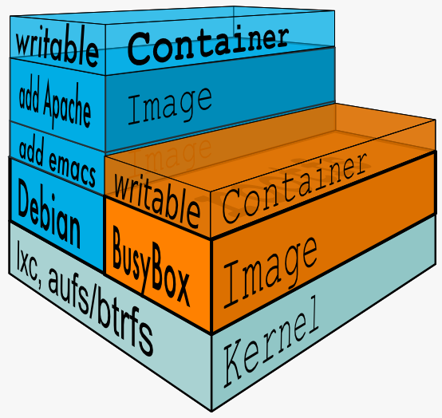

# Docker的常用命令

> 帮助文档地址：https://docs.docker.com/reference/

## 帮助命令

```shell
 docker version
```

显示版本的基本信息


```shell
docker info
```

显示docker的系统信息，包括镜像和容器的数量


```shell
docker 命令 --help
```

显示docker命令的帮助信息


## 镜像命令

```shell
docker images
```

查看所有主机上的镜像

> `-a` / `--all`		显示全部镜像
>
> `-q` / `--quiet`	只显示镜像ID


```shell
docker image inspect [OPTIONS] 镜像名
```

查看镜像的信息（要已经pull下来才行）


```shell
docker search 镜像名
```

搜索镜像

> `--filter=条件`	以条件过滤
>
> > 例如，过滤某STARS数量以上的
> >
> > ```shell
> > docker search mysql --filter=STARS=3000
> > ```


```shell
docker pull 镜像名[:tag]
```

下载镜像，加标签指定版本，默认最新版


```shell
docker rmi 镜像名/镜像ID [其他镜像，空格隔开]
```

删除镜像

> `-f` / `--force`	强制移除
>
> `–no-prune`		  保留没有标签的父镜像


```shell
docker commit [OPTIONS] 容器ID 目标镜像名[:tag]
```

提交容器成为新的镜像副本到本地，该命令

> `-m="描述信息"`			附上提交的描述信息
>
> `-a="作者"`					指明作者


```shell
docker build [OPTIONS] PATH | URL | -
```

构建镜像，放到PATH/URL下

> `-f` 									指定构建镜像使用的Dockerfile的路径，不写则默认为 `PATH/Dockerfile`
>
> `-t 目标镜像名[:tag]`	  指定构建镜像的名字及标签			


## 容器命令

>  有镜像才能创建容器，没有则会先自动拉取相应镜像再创建

```shell
docker run [OPTIONS] 镜像名 命令 [命令参数]
```

新建容器并启动

> `--name=名字`					为新建的容器起名	
>
> `-d 镜像名`						后台运行
>
> > 有时指定了后台启动但无法运行，这是因为后台运行的容器必须有一个前台应用，否则docker会将其视为没有提供服务而将其停止。
>
> `-i` / `--interactive`	  即使未连接，也保持标准输入打开(与之交互)
>
> `-t`									  分配伪TTY
>
> > 上两个一般以 `-it` 的形式连用以进行交互
> >
> > ```shell
> > docker run -it centos /bin/bash
> > # 使用 exit 命令退出终端（容器内如没有其他终端，则容器会自动停止）
> > # 使用 ctrl+P+Q 只退出不停止容器
> > ```
>
> `-p`						指定/映射容器端口
>
> > 只指定容器使用的端口（这种情况下`-p` 可省略）
> >
> > ```shell
> > docker run -p 容器端口 mysql
> > ```
> >
> > 
> >
> > 将主机端口映射到容器的端口
> >
> > ```shell
> > docker run -p 主机端口:容器端口 mysql
> > ```
> >
> > 
> >
> > 映射远端主机端口到容器端口
> >
> > ```shell
> > docker run -p IP:主机端口:容器端口 mysql
> > ```
>
> `-P`						随机指定端口
>
> `–rm`					 容器退出时就自动删除容器，一般用于测试
>
> `-v`						数据卷挂载，详见 [Docker数据卷](#Docker数据卷)


```shell
docker ps
```

查看正在运行的容器

> `-a`			列出所有正在运行的容器及历史运行过的容器
>
> `-n=数量`	显示最近创建的n个容器
>
> `-q`			只显示容器的ID


```shell
docker rm 容器ID
```

删除容器

> `-f` 		强制删除，包括正在运行的
>
> > 删除所有的容器
> >
> > ```shell
> > docker ps -aq | xargs docker rm -f
> > # 或是
> > docker rm -f $(docker ps -aq)
> > ```
> >
> > 


```shell
docker start 容器ID
docker restart 容器ID
```

启动/重启容器


```shell
docker stop 容器ID
```

停止容器


```shell
docker kill 容器ID
```

强制杀死容器


## 常用其他命令

```shell
docker logs 容器ID
```

查看日志

> `-f` / `--follow` 			跟踪日志输出
>
> `-t` / `--timestamps`	显示时间戳
>
> `-n` / `--tail string`	指定从日志末尾起显示的日志行数（默认为“全部”）


```shell
docker top 容器ID
```

查看容器进程信息


```shell
docker stats
```

查看资源占用情况


```shell
docker inspect 容器ID
```

查看容器元数据


```shell
docker exec [OPTIONS] 容器ID/容器名 命令 [命令参数] 
```

在运行中的容器中执行命令（进入容器会开启新的终端）。

> `-i` / `-interactive`	即使未连接，也保持标准输入打开(与之交互)
>
> `-t` / `--tty`				 分配一个伪TTY
>
> > 可以看到与 `run` 命令相似，同样以 `-it` 的形式连用以进入容器进行交互
> >
> > ```shell
> > docker exec -it 容器ID
> > ```


```shell
docker attach 容器ID
```

将本地标准输入、输出和错误流附加到正在运行的容器（也就是接入容器），它进入的正在运行的命令行，而不是新创建一个。


```shell
docker cp 容器ID:容器内路径 主机路径
```

从容器内（无论是否运行）拷贝文件到主机


```shell
docker history 镜像名/镜像ID
```

查看镜像构建历史过程中执行过的指令


# Docker数据卷

Docker可以将应用和环境打包，但数据需要单独保存以保证数据安全，且需要同步来更新。

则可使用Docker的卷技术，将容器内的目录挂载到主机目录。

同时其还可以用作容器间的数据共享。


## 数据卷操作命令


```shell
docker volume create
```

创建一个卷


```shell
docker volume ls
```

查看所有卷


```shell
docker volume inspect [OPTIONS] 卷名 [其它卷名]
```

查看卷的元数据


```shell
docker volume rm
```

移除卷


## 命令挂载

在创建容器时使用 `-v` 指定挂载目录

```shell
docker run -it -v 主机目录:容器内目录 镜像名/镜像ID
```

没有目录将会自动创建目录，挂载是双向绑定的

需要注意的是，主机目录和容器目录都要以 `/` 开头


### 匿名挂载

上述指定路径挂载模式就是匿名挂载。

除此之外，还有只指定容器内路径的匿名挂载方式

```shell
docker run -v 容器内路径 镜像名/镜像ID
```

只指定容器内路径的匿名挂载会将自动以随机字符串命名卷，主机挂载点为 `/var/lib/docker/volumes/随机卷名/_data`


### 具名挂载

```shell
docker run -it -v 卷名:容器内目录 镜像名/镜像ID
```

卷名（如果以 `/` 开头则是指定了主机目录）

默认挂载在主机的挂载点为 `/var/lib/docker/volumes/卷名/_data`


### 挂载权限

可以指定容器内的路径的可读写性。通过下面的参数指定

- `ro`	表示readonly，只读
- `rw`	表示read&write，可读可写，默认

用法如下

```shell
docker run -it -v 卷名:容器内目录:权限参数 镜像名/镜像ID
```


这里的权限指的是容器内操作的权限，例如一旦指定 `ro` 则挂载的路径内容只能在主机改变，而不能在容器里改变。


# Dockerfile

Dockerfile是Docker用来构建镜像的脚本文件。镜像分层，而脚本的一个一个命令都对应一层。用作Dockerfile的文件名字可以随机，约定俗称为`Dockerfile`

每条命令由指令和参数构成，每个指令都是大写的。如下

```dockerfile
FROM centos 						# 指定父层
VOLUME ["volume1","volume1"]		# 生成两个需要挂载的目录
CMD /bin/bash						# 执行命令
```

命令按照从上到下的顺序执行

`VOLUME` 指定的这些目录会建立在镜像中，并作为挂载目录存在。如果在新建容器时没有手动使用`-v` 指定，则默认情况下其每个目录都会被挂载到主机的一个匿名挂载卷下。


之后使用 `docker build` 构建镜像

构建的镜像与正常镜像无异，可以使用 `docker run` 正常创建容器

还可以使用 `docker push` 命令发布。


## Dockerfile指令

### FROM

指定基础镜像，构建的起点

```dockerfile
FROM scratch
```

这里的`scratch` 是一个特殊的镜像，他是一个空镜像，没有依赖，十分小。它一般作为构建基本映像(如 debian 和 busybox)或超级最小映像(只包含单个二进制文件和它需要的任何东西，如 hello-world)的上下文而使用。

从 Docker 1.5.0(特别是 Docker/Docker # 8827)开始，`FROM scratch` 在 Dockerfile 中是无操作的，不会在图像中创建额外的图层(所以以前的2层图像将是1层图像)，也就是说，下一个命令是映像中的第一个文件系统层。此外，它不能通过pull拉取。


### MAINTAINER

指定作者（维护者）信息，一般是姓名+邮箱

```dockerfile
MAINTAINER 
```


### RUN

指定构建镜像的时候需要执行的命令

```dockerfile
RUN 
```


### ADD

添加新的内容，

```dockerfile
ADD
```

源文件必须和Dockfile位于同一目录下（使用绝对路径是没用的，会提示找不到你的源文件）


### WORKDIR

指定镜像的工作目录，在初始化容器时会进入这个目录

```dockerfile
WORKDIR
```


### VOLUME

设置需要挂载的目录

```dockerfile
VOLUME
```


### EXPOSE

指定暴漏端口

```dockerfile
EXPOSE 
```


### CMD

 指定生成容器时要运行的命令。当指定多个时，只有最后一个会生效，可被替代

```dockerfile
CMD
```


### ENTRYPOINT

 指定生成容器时要运行的命令，可用于追加命令。

```dockerfile
ENTRYPOINT
```


### ONBUILD


```dockerfile
ONBUILD
```


### COPY

将文件拷贝到镜像中。

```dockerfile
COPY
```

源文件必须和Dockfile位于同一目录下（使用绝对路径是没用的，会提示找不到你的源文件）


### ENV

构建镜像的时候设置环境变量

```dockerfile
ENV
```


# Docker原理

## 联合文件系统 （UnionFS）

UnionFS是一种分层、轻量级并且高性能的文件系统，它支持对文件系统的修改作为一次提交来一层层的叠加，同时可以将不同目录挂载到同一个虚拟文件系统下（unite several directories into a single virtual filesystem）。union文件系统是Docker镜像的基础。镜像可以通过分层来进行继承，基于基础镜像（没有父镜像），可以制作各种具体的应用镜像。


## base镜像

base 镜像有两层含义：

- 不依赖其他镜像，从 scratch 构建。
- 其他镜像可以之为基础进行扩展。

base 镜像的通常都是各种 Linux 发行版的 Docker 镜像，比如 Ubuntu, Debian, CentOS 等，以 CentOS 为例学习 base 镜像包含哪些内容。


## Docker分层



**Linux层次**

bootfs（boot file system）主要包含bootloader和kernel，bootloader引导加载kernel。在Linux系统启动时将首先加载bootfs文件系统，Docker镜像最底层的就是bootfs，与典型的Linux/Unix是一样的，包含了bootloader和kernel。boot加载完后kernel就在内存中了，使用权也由bootfs转交给kernel，此时系统会卸载bootfs。

rootfs（root file system），在bootfs之上，包含了标准Linux的文件系统（/dev，/bin，/etc等）。不同发行版的Linux（Ubuntu，Centos等）对应了不同的rootfs。


**Docker运行**

对于 base 镜像来说，底层直接用 Host 的 kernel，自己只需要提供 rootfs 就行了。而精简的rootfs 可以很小，所以只需要包括最基本的命令、工具和程序库就可以了。 Docker 可以同时支持多种 Linux 镜像，模拟出多种操作系统环境。

运行容器只能使用 Host 的 kernel，并且不能修改。所有容器都共用 host 的 kernel，在容器中没办法对 kernel 升级。如果容器对 kernel 版本有要求（比如应用只能在某个 kernel 版本下运行），则不建议用容器，这种场景虚拟机可能更合适。


**Docker镜像分层**

docker镜像是实际上就是一堆只读层（read-only layer）的统一视角。

```shell
"Layers": [
"sha256:14a1ca976738392ffa2ae4e54934ba28ab9cb756e924ad9297a4795a4adbfdf6",
"sha256:a6b7270e6c20bae1d8c5d009171ce7db2e268c3d32e447a2ec4f33b02b256955",
"sha256:cf2aefb51919d2cf15e3311fec4e187f968e06f168ee610d500e81757b53a3f7",
"sha256:1d07bac5c7c7346740c618c2aa66e42d3042f1e231fc19128b90ab3839154cae",
"sha256:9cf6f7d59322e560ceafc06f8896f3c8b0edca76b0598a4d4873850f4ee337eb",
"sha256:e32a54e9cf7b7e9c94e5d3cd970b1f86be965a3723cc684f5013abb640e95482"
]
```


这些多个只读层重叠在一起：除了最下面一层，其它层都会有一个指针指向下一层。这些层是Docker内部的实现细节，并且能够在主机的文件系统上访问到。统一文件系统（union file system）技术能够将不同的层整合成一个文件系统，为这些层提供了一个统一的视角，这样就隐藏了多层的存在，在用户的角度看来，只存在一个文件系统。

每个只读层都保存了相对于上一层的改动的相关数据，保存的内容仅为最上层读写文件系统中被更新过的文件。分层达到了在不的容器同镜像之间共享镜像层的效果。


## Docker容器

容器（container）的定义和镜像（image）几乎一模一样，也是一堆层的统一视角，唯一区别在于容器的最上面那一层是可读可写的。

一个运行态容器（running container）被定义为一个可读写的统一文件系统加上隔离的进程空间和包含其中的进程。一个容器中的进程可能会对文件进行修改、删除、创建，这些改变都将作用于可读写层（read-write layer）。


**写时复制**

docker 镜像使用了写时复制(copy-on-write)的策略，在多个容器之间共享镜像，每个容器在启动的时候并不需要单独复制一份镜像文件，而是将所有镜像层以只读的方式挂载到一个挂载点，再在上面覆盖一个可读写的容器层。在未更改文件内容时，所有容器共享同一份数据，只有在 docker 容器运行过程中文件系统发生变化时，才会把变化的文件内容写到可读写层，并隐藏只读层中的老版本文件。写时复制配合分层机制减少了镜像对磁盘空间的占用和容器启动时间。


当使用 docker commit 提交这个修改过的容器文件系统为一个新的镜像时，保存的内容仅为最上层读写文件系统中被更新过的文件。


## 联合挂载

联合挂载是用于将多个镜像层的文件系统挂载到一个挂载点来实现一个统一文件系统视图的途径，是下层存储驱动(aufs、overlay等) 实现分层合并的方式。

联合挂载技术可以在一个挂载点同时挂载多个文件系统，将挂载点的原目录与被挂载内容进行整合，使得最终可见的文件系统将会包含整合之后的各层的文件和目录。实现这种联合挂载技术的文件系统通常被称为联合文件系统(union filesystem)。


# Docker可视化工具

## portainer

Docker图形化界面管理工具，提供一个后台面板

安装

```shell
docker run -d -p 8088:9000 --restart=always -v /var/run/docker.sock:var/run/docker.sock --privileged=true portainer/portainer
# --restart=always 		表示docker重启动后，容器自启动
# -v ...  				表示挂载，本机数据:容器数据
# --privileged=true		授权
```


## Rancher

CI / CD


## Rancher


# 实战

## 安装启动nginx

```shell
# 1. 拉取镜像
docker pull nginx
# 2. 创建容器“Nginx01”并后台运行
#	 这里完成了端口映射工作
docker run -d --name="Nginx01" -p 8080:80 nginx
# 3. 检测运行正常(使用crul命令抓取端口数据)
crul localhost:80
# 4. 进入容器进一步配置
docker exec -it Nginx01 /bin/bash
# 5. 退出容器，查看ID
exit
docker ps
# 5. 停止容器
docker stop 881ca283f7a1
```


## 安装启动tomcat

```shell
# 1. 拉取特定版本的镜像
docker pull tomcat:9.0
# 2. 创建容器
docker run -d -p 3344:8080 --name="Tomcat01" tomcat
# 3. 进入tomcat
# docker attach Tomcat01 #会进入tomcat的输出端口，需要操作的话不要用这个
docker exec -it Tomcat01 /bin/bash
# 由于默认镜像都是最小镜像，则所有不必要的文件都精简了（默认的启动案例在webapps.dist目录下）
# 4. 移动自带案例
cp -r webapps.dist/* webapss/
# 5. 退出并查看资源占用
exit
docker stats
# 6. 停止服务
^C
docker stop Tomcat01
```


## 安装部署Mysql

```shell
# 1. 拉取最新版
docker pull mysql
# 2. 创建运行mysql容器，进行数据挂载，端口映射以及账户设定
docker run -d -p 3310:3306 -v /home/mysql/conf:/etc/mysql/conf.d -v/home/mysql/data:/var/lib/mysql -e MYSQL_ROOT_PASSWORD="1235789" --name="Mysql01" mysql

```


## 安装部署 es+kibana

```shell
# 1. 直接创建
#	 由于elasticsearch完全运行十分耗内存，则使用 -e 添加参数对运行内存做进一步限制
docker run -d --name Elasticsearch01 -p 9200:9200 -p 9300:9300 -e ES_JAVA_OPTS="-Xms64m -Xmx512m" elasticsearch:7.11.1
```


## 创建自定义centos

```shell
cd /home				# 进入home目录
mkdir DockerFile		# 创建目录并
cd DockerFile
vim centosDockerfile 	# 编辑Dcokerfile文件
```

```dockerfile
FROM centos
MAINTAINER zk<1256686822@qq.com>

ENV MYPATH /usr/local
WORKDIR $MYPATH
RUN yum -y install vim 
RUN yum -y install net-tools
EXPOSE 80

CMD echo $MAPATH
CMD echo "Build Over"
CMD /bin/bash
```

```shell
docker build -f centosDockerfile -t mycentos:0.1 .	# 构建镜像
docker run -it mycentos:0.1							# 新建容器
```


## 创建自定义Tomcat

准备镜像所需的文件：Tomcat压缩包、jdk包


编写Dockerfile文件

```dockerfile
FROM centos
MAINTAINER zk<1256686822@qq.com>

COPY readme.txt /usr/local/readme.txt

ADD apache-tomcat-10.0.4.tar.gz /usr/local/
ADD openjdk-16+36_linux-x64_bin.tar.gz  /usr/local/

RUN yum -y install vim

ENV MYPATH /usr/local/
WORKDIR $MYPATH
ENV JAVA_HOME /usr/local/jdk-16
ENV CLASSPATH $JAVA_HOME/lib/dt.jar:$JAVA_HOME/lib/tools.jar
ENV CATALINA_HOME /usr/loacl/apache-tomcat-10.0.4
ENV CATALINA_BASH /usr/local/apache-tomcat-10.0.4
ENV PATH $PATH:$JAVA_HOME/bin:$CATALINA_HOME/lib:$CATALINA_HOME/bin

EXPOSE 8080
CMD /usr/local/apache-tomcat-10.0.4/bin/startup.sh && tail -F /url/local/apache-tomcat-10.0.4/bin/logs/catalina.out
```

构建

```shell
docker build -t mytomcat:0.1 .  # 这里要注意，镜像名字母必须全小写
```

部署

```shell
docker run -d -p 9090:8080 --name="myTomcat" -v /home/myTomcat/test:/url/local/apache-tomcat-10.0.4/webapps/test -v /home/myTomcat/logs:/url/local/apache-tomcat-10.0.4/logs
```


